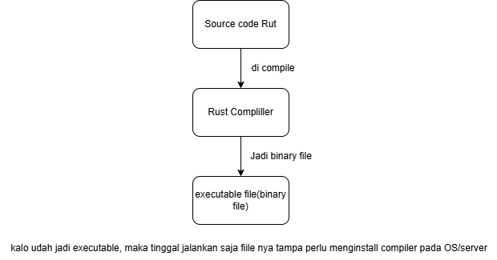
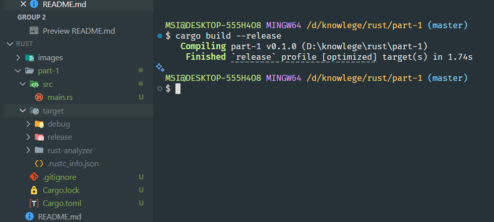

# BELAJAR RUST

Siapin otak kelean yak **Gays**

## Requirement

- sehat
- punya keinginan yang kuat untuk belajar
- paham cara make komputer
- punya pengalaman bahasa pemograman lain
- dan yang paling penting **TIDAK GILA**

## Sejarah Rust

Rust pertama kali dibuat dengan proyek pribadi oleh karyawan mozila yang bernama **Graydon Hoare** di tahun 2006. Pada tahun 2009 mozila mulai mendukung proyek ini dan melakukn percobaan untuk membuat browser engine yang diberi nama **SERVO**, dan secara official diumumkan ke public sekitar 2010.

Rust dirilis secara public oleh mozila pada tahun 2015, dan sekarang rust banyak digunakan di perusahaan-perusahaan besar seperti Discord, Google, Meta, DropBox dll. Pada tahun 2022, Rust rust menjadi salahsatu bahasa pemograman yang didukung untuk pengembangan Linux Kernel, selain bahasa C dan Assambly.

## Kenapa Rust??

Rust memiliki memory safety, maksudnya rust memiliki sistem pemrosesan memory yang aman, tidak seperti C, C++, Java dll yang mana kita harus melakukan menejemen memory secara manual. Selain itu Rust juga merupakan bahasa pemograman yang high performace bahkan di beberpa hal kecepatan rust bisa hampir menyamai kecepatan bahasa C/C++.

Rust juga memiliki concurrency yang sangat safety dan sangat baik, ini sanat mendukung untuk pembuatan applikasi yang sangat high performace.

## Proses Pengembangan Applikasi Berbasis Rust



## Installasi Rust

```sh
curl --proto '=https' --tlsv1.2 -sSf https://sh.rustup.rs | sh
```

Untuk memperiksa apakah rust nya udah keinstall dengan bener kita bisa menjalankan perintah

```sh
rustup check
```

atau

```sh
rustc --version
```

dan untuk memngupdate versi rust nya, kita bisa menjalankan perintah

```sh
rustup update
```

## Membuat project rust

ketika kita menginstall rustup kita juga diberikan sebuah package manager yang bernama cargo. kita bisa memanfaatkan cargo untuk membuat project denga cara menjalankan command berikut.

```sh
cargo new nama_project
```

## File extension

Tiap tiap bahsa pemrogramman itu memiliki ektensi nya masing-masing, misalnya java ektensinya .java, C++ extensinya .cpp, golang ektensi nya .go, typescript extensinya .ts. Demikikian juga sama rust, extensi dari rust adalah .rs  
misalnya kita ingin membuat source code rust maka kita bisa membuat file dengan ektensi .rs.  
example: `main.rs`

## Hello Wolrd

```rs
fn main(){
    println!("Hello, world!");
}
```

Bahasa pemrogramman Rust itu sama seperti bahasa pemograman C++, Java dll yang mana membutuhkan main function. Main function merupakan gerbang utama atau kode utama yang akan dijalankan oleh Rust. Untuk membuat main function pada bahasa pemogramman Rust kita bisa menggunakan keyword `fn`.

## Print Function

Pada bahasa pemrogramman Rust jikalau kita ingin menampilkan sesuatu ke layar kita bisa menggunakan build in function misalnya seperti :

```rs
print!("Hello") // print ke console tampa melakukan enter
```

```rs
println!("Mas Ganteng") // menampilkan ke layar dengan melakukan enter
```

## Cargo

Ketika kita akan membangun Applikasi yang besar tentunya kita akan membutuhkan package manager untuk mengelola dependensi dari applikasi yang kita buat. Dengan menggunakan package manager kita bisa dengan mudah untuk mengelola dependensi, melakukan kompilasi, melakukan unit test dan sebagainya. Dengan adanya Dependensi manajemen ini kita sebagai developer dapat lebih produktif untuk mengembangkan applikasi

Sebelumnya kita telah menyinggung tentang **Cargo**. Pada bahasa pemogramman Rust kita bisa menggunakan Cargo sebagai Depensi manajemen kita.

## Membuat Distribusi File

Ketika kita sudah selesai develop sebuah applikasi tentunya kita akan membuat distribusi file untuk di upload ke server dan dijalankan di sisi server. Untuk melakukan hal tersebut pada bahasa pemogramman Rust kita bisa memanfaatkan perintah Cargo.

```sh
cargo build --release
```

Maka kita akan diberikan sebuah folder release didalam target. dan didalam folder release terdapat sebuah executable file yang kita bisa distribusikan ke server.  
 

## Unit Test

Dalam project Rust hanya boleh memiliki 1 main function. Hal tersebut tentunya bakal menjadi masalah kita kita baru belajar Rust karena tentunya kita akan membuat main function berkali kali untuk belajar dan bereksperimen.

Oleh karena itu alternatif yang bisa kita gunakan yaitu Unit test. Sama seperti bahasa pemogramman lain seperti Java, Golang, Typescript dan sebagainya, Rust juga memiliki Unit test yang bisa kita manfaatkan untuk bereksperimen atau belajar bahasa pemrogramman Rust.

Untuk membuat Unit test pada bahasa pemrogramman Rust caranya cukup sederhana kita bisa menggunakan arrtibute/annotation `#[test]` diatas kode fucntion.

```rs
#[test]
fn test_hello() {
    println!("Hallo Mas ganteng >_<")
}
```

Untuk menjalankan kode unit test kita diatas kita bisa jalankan perintah `cargo test nama_function -- --exact`

```sh
cargo test test_hello -- --exact
```

Untuk kedepanya kita akan menggunakan unit test untuk belajar Rust.

## Variable

Variable adalah tempat menyimpan suatu data. Untuk membuat variable pada bahasa pemogramman Rust kita bisa menggunakan keyword `let` dan diikuti dengan nama variable. Pada bahasaa pemogramman Rust ketika variable tersebut telah di isi data maka variable tersebut tidak dapat diubah(variable bersifat immutable)

```rs
#[test]
fn test_variable() {
    let nama = "mas mas ganteng >_<"; // variable tidak dapat diubah(bersifat immutable)
    println!("Hallo {}", nama);
}
```

## Mutable

Pada chapter variable kita telah mengetahui bahwa variabel itu bersifat immutabel atau tidak bisa diubah lagi, namun jikalau kita ingin mengubah variable tersebut bersifat muttable itu bisa. Pada bahasa pemrogramman Rust untuk membuat variable yang bersifat mutable kita bisa menggunakan keyword `let mut`

```rs
#[test]
fn test_mutable() {
    let mut nama = "Mas kim";
    println!("nama saya {}", nama); // Output => nama saya Mas kim
    nama = "Mas Nardji"; // reassign nilai variable
    println!("Nama saya {}", nama); // Output => nama saya Mas Nardji
}
```

## Static Typing

Rust adalah bahasa yang menganut _Static Typing_ artinya setiap kita membuat variable atau sebuah function jenis datanya harus fix dan tidak dapat berubah lagi.

Pada chapter sebelumnya kita telah membuat variable dengan tipe data string atau text, ketika variable tersebut kita reassign dengan tipe data number.

```rs
#[test]
fn test_static_typing() {
    let mut nama = "mas kim";
    println!("nama saya {}", nama);
    nama = 10; // ini akan error
    println!("nama saya {}", nama);
}
```

## Variable Shadowing

Pada bahasa pemrogramman Rust kita bisa membuat variable dengan nama yang sama. Namun ketika kita membuat variabel dengan nama yang sama maka variabel sebelumnya dengan nama yang sama akan menjadi variable shadowing atau menjadi tertutup.  
Praktik ini tidak begitu disarankan karena kedepanya dapat membingungkan kita ketika membaca baris kode.

```rs
#[test]
fn test_shadowning() {
    let name: &str = "Mas Kim"; // ini akan menjadi variable shadowing(tertutup tidak dapat di akses oleh baris paling bawah setelah variabel baru dengan nama sama di deklarasikan)
    println!("nama saya {}", name);

    let nama = 22;
    println!("Umur saya {}", nama);
}
```

## Tipe Data

Pada bahasa pemrogramman Rust tipe data secara garis besar terbagi menjadi 2 subset yaitu:

- **Skalar:** Merepresentasikan singgle value(nilai tunggal) misalnya seperti integer, float, boolean, char
- **Compound:** Merepresentasikan beberapa nilai dalam 1 tipe misalnya seperti Array, atau Tuple

| Scalar Type | Deskripsi                                         |
| ----------- | ------------------------------------------------- |
| Integer     | Tipe data anggka dalam bilangan bulat             |
| Float       | Tipe data angka dalam bilangan desimal(pecahan)   |
| Boolean     | Tipe data yang hanya bernilai true atau false     |
| Char        | Tipe data karakter (huruf)                        |

| Compound Type | Deskripsi                                                           |
|--------------|---------------------------------------------------------------------|
| Array         | Kumpulan beberapa data(data collection) dengan tipe data yang sama  |
| Tuple         | Kumpulan beberap data(data collection) denga tipe data berbeda-beda |

## Explicit Type

Di pemogramman dengan bahasa Rust ketika kita memnbuat variable kita tidak perlu menyebutkan tipe datanya secara explicit, karena Rust dapat mendeteksi secara otomatis tipe daatanya berdasarkan value yang kita tugaskan/assign kedalam variable tersebut. Namun jikalau kita ingin menyebutkan tipe datanya kita bisa menambahkan tanda (:) setelah nama variable.

```rs
#[test]
fn test_tipe_data() {
    // secara explisit
    let umur = 22;

    // secara implisit
    let usia: i32 = 22;

    println!("Umur saya {}", umur);
    println!("Usia saya {}", usia);
}
```

## Integer

Berikut ini adalah tabel yang berisi jenis-jenis tipe bilangan bulat integer 

| Panjang | Signed | Range Signed                     | Unsigned | Range Unsigned 
|---------|--------|----------------------------------|----------|---------------------
| 8-bit   | i8     | -128 - 127                       | u8       | 0 - 255 
| 16-bit  | i16    | -32,768 - 32,767                 | u16      | 0 - 65,535 
| 32-bit  | i32    | -2,147,483,648 - 2,147,483,647   | u32      | 0 - 4,294,967,295 
| 64-bit  | i64    | -9,223,372,036,854,775,808 - 9,223,372,036,854,775,807 | u64 | 0 - 18,446,744,073,709,551,61 
| 128-bit | i128   | -170,141,183,460,469,231,731,687,303,715,884,105,728 - 170,141,183,460,469,231,731,687,303,715,884,105,727| u128 | 0 - 340,282,366,920,938,463,463,374,607,431,768,211,455

### Float

Berikut ini adalah jenis-jenis tipe data bilangan floating poin atau pecahan 
| Panjang  | Float 
|----------|---------- 
| 32-bit   | f32 
| 64-bit   | f64

### Usize

Usize adalah tipe data integer yang panjang bit nya megikuti dari platform Sistem Operasi yang digunakan, misalnya jikalau kita menggunakan Linux dengan 64-bit maka unize nya akan menjadi 64-bit.

| Usize           | Keterangan    |
|-----------------|---------------|
| isize           | 32-bit/64-bit |
| usize(Unsigned) | 32-bit/64-bit |

## Defaut jenis Integer yang Digunakan

Ketika kita membuat variable dengan nilai number secara explisit(tidak menyebutkan jenis nya) maka Rust akan menggunakan defaut jenis number nya. jika bilangan bulat maka Rust akan menggunakan `i32` dan jikalau bilangan floating/pecahan maka akan menggunakan `f64`.

```rs
#[test]
fn test_number(){
    let angka = 10; // maka by defautl akan menggunakan jenis i32/32-bit
    let pecahan = 10.5; // maka by defautl akan menggunakan jenis f64/64-bit
    println!("angaka {}, pecahan {}", angka, pecahan);
}
```

## Number Conversion

Rust bisa melakukan konversi jenis tipe data number dari yang ukuranya kecil misalnya `i8` ke ukuran yang lebih besar misalnya `i16` begitupun sebaliknya. Namun perlu berhati-hati ketika melakukan konversi dari jenis yang besar misalnya `i16` ke jenis yang kecil misalnya `i8`, jikalau nilai dari `i16` itu lebih besar size nya dari pada jenis konversi nya misalnya `i8` maka akan terjadi error `Integer Overflow`.  
Untuk melakukan konversi kita bisa menggunaka keyword `as`;

```rs
#[test]
fn number_conversion() {
    let angka: i8 = 20;

    // melakukan konversi dari jenis i8 ke i16
    let angka2: i16 = angka as i16;

    println!("angaka {}", angka2);


    // melakukan konversi dari i16 ke i8
    let numer: i16 = 100;
    let number2: i8 = numer as i8;

    println!("number {}", number2);


    let bil: i32 = 500;
    let bil2: i8 = bil as i8; // ini akan terjadi Error Integer Overflow
}
```

## Operator Aritmatika

Berikut ini adalah tabel operator aritmatika 
| Operator | deskripsi 
|----------|------------------- 
| +        | penjumlahan 
| -        | pengurangan 
| *        | perkalian 
| /        | pembagian 
| %        | modulus/sisa bagi

```rs
#[test]
fn test_operator_aritmatika(){
    let a = 10;
    let b = 12;
    let hasil = a * b; // contoh perkalian
    println!("hasil {}", hasil)
}
```

## Operator komparasi

Berikut ini adalah operator komparasi yang dapat kita gunakan dalam bahasa pemrogramman Rust. 
| Operator | deskripsi 
|----------|----------- 
| >        | lebih dari 
| <        | kurang dari 
| =>       | lebih dari samadengan 
| <=       | kurang dari sama dengan 
| ==       | sama dengan

## Char

Char adalah tipe data karakter, untuk membuat tipe data char pada Rust kita bisa menggunakan tanda petik satu `''` dan diikuti dengan 1 karakter.

```rs
#[test]
fn test_char() {
    let a: char = 'p';
    let b: char = 's';
    println!("karakter a => {}", a);
    println!("karakter b => {}", b);
}
```

## Tuple

Tipe data tuple adalah tipe data kumpulan atau collection yang mana isinya lebih dari 1 tipe data biasanya. Jumlah data pada tuple sudah final atau fix tidak bisa bertambah atau berkurang. Misalnya kita membuat data dengan tipe data tuple dengan jumlah data 4 maka jumlah data tersebut tidak bisa dikurangi atau di tambah. Untuk membuat data dengan tipe data tuple kita bisa menggunakan simbol kurung `()` setelah itu kita isikan tipe data tipe data yang inigin kita gunakan didalam kurung.

```rs
#[test]
fn test_tuple() {
    let data: (i32, f32, char) = (1000, 2.7, 'a');
    println!("{:?}", data)
}
```

## Mengakses Tuple
Sebelumnya kita telah mempelajari bagaimana cara membuat data dengan tipe data tuple, namun bagaimana cara untuk mengakses tiap-tiap datanya??  
Untuk melakukan hal tersebut kita bisa melakukan degan cara menggunakan `.` setelah intu index dari tuple nya.

NOTE: Index tuple dimulai dari 0
```rs
#[test]
fn test_access_tuple() {
    let data: (char, i8, bool) = ('a', 10, false);

    let char1: char = data.0;
    let angka: i8 = data.1;
    let boolean: bool = data.2;

    println!("karakter {} angka {} boolean {}", char1, angka, boolean);
}
```

## Destucturing Tuple
Sebelumnya kita telah mengetahui cara mengakses data tuple. Ada satu cara lagi untuk mengakses data tuple tersebut, yaitu dengan cara destucturing.

``` rs
#[test]
fn test_desctucturing_tuple() {
    let data: (i32, char, bool) = (10, 's', true);
    let (angka, karakter, boolean) = data; // destructuring tuple
    println!("angak {} karakter {} boolean {}", angka, karakter, boolean)
}
```
## Muttable Tuple
Sebelumnya ketika kita membuat tipe data tuple seperti yang kita lakukan diatas, tipe data tuple tersebut bersifat mutable artinya tiap-tiap datanya tidak dapat diubah lagi atau sudah fix. Jikalau kita ingin tipe data tuple tersebut bersifat mutable atau isi data nya dapat diubah kembali kita bisa menggunakan keyword mut setelah keyword let.

```rs
#[test]
fn test_muttable_tuple() {
    let mut data: (i16, bool, char) = (10, true, 's');

    println!("angka {} boolean {} char {}", data.0, data.1, data.2);

    // reassigment data tuple, data tuple tidak imutable
    data.0 = 20;
    data.1 = false;
    data.2 = 'a';

    println!("angaka {} boolean {} char {}", data.0, data.1, data.2);
}
```

## Unit
Unit pada bahasa pemrogramman Rust adalah tipe data tupple kosong `()` artinya tuple tampa nilai apapun. Unit ini biasanya digunakan untuk function yang tidak memiliki return value
``` rs
// fungsi yang tidak memiliki return value
fn unit() {
    println!("Halo mas ambarawa");
}

#[test]
fn test_unit() {
    // ketika kita memanggil fungsi unit() maka fungsi unit() akan mengembalikan tuple kosong
    let result: () = unit();
    println!("{:?}", result);
}
```

## Array
Tipe data array termasuk tipe data collection, tipe data array merupakan tipe data yang berisi kumpulan data; mirip seperti tipe data tuple namun yang membedakan tipe data array dengan tuple adalah: pada tipe data tuple kita bisa menggunakan banyak tipe data untuk element-element nya jikalau pada array kita hanya boleh menggunakan satu tipe data saja.  
  
Untuk membuat tipe data array kita bisa menggunakan simbole `[]` dan didalam kurung siku memiliki 2 parameter:
- parameter pertama tipe data
- parameter kedua panjang element

``` rs
#[test]
fn test_array() {
    /**
     * [char, 5] => char merupakan 
     * */
    let array: [char; 5] = ['a', 'b', 'c', 'd', 'e'];
    println!("{:?}", array);
}
```

Untuk mengakses elemen array kita bisa mengaksesnya dengan menyebutkan index nya:
``` rs
#[test]
fn test_akses_index() {
    let array: [char; 5] = ['1', '2', '3', '4', '5'];
    let elemen1: char = array[0]; // mengakses elemen array dengan menggunakan INDEX dari array
    println!("elemen array 1 {}", elemen1);
}
```

## Mutable Array
Sebelumnya kita telah mempelajari mengenai tipe data array. By default saat kita membuat variabel dengan tipe data array maka tiap-tiap elemen nya tidak bisa dirubah kembali(bersifat immutable) jikalau kita ingin bisa mengubah elemen array nya maka kita harus mengubah variable tersebut menjadi `muttable`.

``` rs
#[test]
fn test_muttable_array() {
    // membuat array dengan tipe data number u8 dan bersifat mutable
    let mut array: [u8; 5] = [1, 2, 3, 4, 5];
    println!("array baru => {:?}", array);

    // mengubah nilai dari tiap tipa elemen array
    array[0] = 7;
    array[1] = 8;
    array[2] = 9;
    array[3] = 10;
    array[4] = 11;

    println!("array setelah dibuah ==>>{:?}", array);
}
```
Jika kita ingin mengetahui panjang atau banyaknya elemen array kita bisa menggunakan fungsi `len()` milik array.


``` rs

#[test]
fn test_muttable_array() {
    // membuat array dengan tipe data number u8 dan bersifat mutable
    let mut array: [u8; 5] = [1, 2, 3, 4, 5];
    // mengubah nilai dari tiap tipa elemen array
    array[0] = 7;
    array[1] = 8;
    array[2] = 9;
    array[3] = 10;
    array[4] = 11;
    /**
     * ketika kita memanggil fungsi len() maka len() akan mengembalikan angka
     * sesuai banyaknya elemen array dengan tipe data usize
     * */
    let length: usize = array.len();
    println!("panjang array {}", length);
}
```

## Array dua Dimensi
Array dua dimensi adalah tipe data array yang mana elemen nya merupakan array(array didalam array). hal tersebut biasanya sering sekali kita lakukan ketika kita mengembangkan sebuah applikasi.
``` rs
#[test]
fn array_dua_dimensi() {
    // array dua dimensi
    let array2d: [[i8; 3]; 3] = [
        [1, 2, 3],
        [4, 5, 6],
        [7, 8, 9]
    ];

    println!("Array 2 dimensi");
    println!("{:?}", array2d)
}
```

## Constant
Constant adalah sebuah variabel yang bersifat immutabel(tidak dapat diubah nilainya) yang dibuat dengan keyword `const`. `const` dan `let` merupakan keyword untuk membuat variabel namun yang membedakan keyword `const` dan `let` yaitu: 
- **const**
  - `const` tidak dapat diubah menjadi muttabel
  - nilai dari variable `cosnt` harus langsung dideklarasikan ketika variabel dibuat
- **let**
  - `let` bisa diubah menjadi muttabel dengan keyword `mut`
  - nilai variabel yang dibuat menggunakan `let` tidak harus langsung di deklarasikan ketika variabel dibuat.
  
Untuk membuat variabel dengan menggunakan keyword `const` kita harus menyebutkan tipe datanya secara explisit dan nama variabel harus menggunakan huruf kapital, jikalau nama variabelnya lebih dari 1 kata maka pemisah dari nama variabel tersebut menggunakan (_), atau simpelnya menggunakan format `snake case`

``` rs 
const MAXIMUM_VALUE: i32 = 500;
#[test]
fn test_constant() {
    const MINIMUM_VALUE: i32 = 5;
    println!("nilai minimum {}, nilai maksimum {}", MINIMUM_VALUE, MAXIMUM_VALUE)
}
```

## Gerbage Collection
*Gerbage Collection* adalah sebuah feature yang banyak digunakan oleh banyak bahasa pemrogramman misalnya seperti Go, Java untuk melakukan management memory. Cara kerja *Gerbage Collection* yaitu dengan cara memantau data yang sudah tidak diguanakan lagi di memory dan menghapus data tersebut secara otomatis.  
  
Namun ada juga bahasa pemrogramman yang tidak memiliki *gerbage collection* misalnya seperti C atau C++. Bahasa pemrogramman yang tidak memiliki *Gerbage collection* harus melakukan menejemen memory secara manual, jadi kita sebagai programmer kita harus mengalokasikan atau menghapus data di memory secara manual.  
  
Bahsa pemrogramman Rust memiliki pendekatan yang berbeda untuk menejemen memory. Rust tidak memiliki *gerbage collection* dan Rust tidak melakukan menejemen memory secara manual.

## Stack dan Heap
Rust menggunakan pendekatan *Stack* dan *Heap* unutk melakukan menejemen memory.  
**Stack:** adalah tempat penyimpanan data dalam struktur data stack(*first in last out*) atau tumpukan. Data yang disimpan dalam Stack ukuranya sudah fixed atau sudah pasti.

Contoh:
``` rs
#[test]
fn test(){
    // data umur ini akan disimpan pada Stack karena ukuranya fixed, yaitu i32
    let umur: i32 = 22;
    println!("Umur saya {}", umur);
}
```

**Heap:** Adalah tempat penyimpanan data yang ukuranya belum fixed atau belum pasti. Ketika terapat data yang berlum fixed. Rust akan melakukan Request kepada *Heap* dan  *Heap* akan meperintah Memory Allocator untuk mencari area kosong didalam memory dan menyimpan data tersebut didalam area tersebut; Setelah Memory Allocatory berhasil mentimpan data maka Kita akan diberikan Pointer(petunjuk/address) dimana data tersebut disimpan didalam memory, Dan setelah itu pointer tersebut disimpan di *Stack* karena pointer tersebut bersifat fixed.  

Contoh:

``` rs
fn fungsi_1() {
    // variabel umur akan disimpan di stack
    let umur: i32 = 22;

    /*
     * variabel nama ini akan disimpamn di heap karena tipe data String itu ukuranya tidak fixed
     * bisa saja kecil dan bisa saja besar tergantung banyaknya kareketer yang disimpan
     */
    let nama: String = String::from("Mas Kim");
    println!("Nama saya {}, umur saya {}", nama, umur);
}

fn fungsi_2() {
    let umur: i32 = 22;
    let nama: String = String::from("Mas Kim");
    println!("Nama saya {}, umur saya {}", nama, umur);
}


#[test]
fn test_heap_stack() {
    /*
     * kedua funcsi ini akan disimpan di stack
     */
    fungsi_1();
    fungsi_2();
}
```

Dibawah ini adalah diagram bagaimana kode diatas di proses oleh heap dan stack pada bahasa pemrogramman rust.  


## &str dan String
Pada bahasa pemrogramman rust terapat 2 tipe data string:
- **&str(string slice):**
tipe data ini berisfat fix tidak bisa bertambah atau mengurang ukuranya, maka dari itu rust akan menyimpaan data dengan tipe &str pada stack

- **String:**
Sedangkan tipe String ini bersifat growable, artinya size nya bisa bertamabah atu berkurang, maka rust akan mentimpan data dengan tipe String pada memory Heep.


## Immutable &str
Karena ukuran dari &`str` itu fix size maka operasi yang kita dapat gunakan untuk tipe data `&str` adalah operasi immutable, maksudnya isi dari tipe data `&str` tidak dapat diubah.


```rust
#[test]
fn strnig() {
    /*
     * &str memiliki banyak operasi yang bisa digunakan, salah satunya adalah trim()
     * ketika kita melakukan trim() data pada variabel nama tidak akan berubah
     * karena &str itu bersifat immutable (tidak bisa diubah)
     * sehingga kita perlu menampung hasil dari trim() ke dalam variabel baru
     */
   let nama: &str = " God of War ";
   let new_name: &str = nama.trim();

    println!("nama 1 {}", nama);
    println!("nama 2 {}", new_name);
}
```


## Stirng type
Stirng pada rust merupakan tipe data text UTF-8, dan bisa berkembang ukuranya, namun ketika kita membuat string dengan immutable maka size nya akan fix namun data tersebut teap akan disimpan pada heap.

Untuk menambahkan atau menguragi dari data dengan tipe Stirng kita harus memastikan bahwa data tersebut bersifat mutable, dengan demikian data tersebut pada heep dapat berkembang atau berkurang.

`String` juga memilik banyak method yang dapat kita gunakan untuk detailnya bisa kunjungi disini https://doc.rust-lang.org/beta/std/string/struct.String.html

``` rust
#[test]
fn string_type() {
    /*
     * String itu bersifat mutable (bisa diubah)
     * sehingga ketika kita melakukan trim() data pada variabel nama akan berubah
     * dan tidak perlu menampungnya ke dalam variabel baru
     */
    let mut nama: String = String::from(" God of War ");
    nama = nama.trim().to_string(); // melakukan trim() dan mengubahnya ke tipe data String

    println!("game saya {}", nama);

    nama.push_str(" Ragnarok"); // menambahkan string ke variabel nama
    println!("game saya {}", nama);
}
```

## Ownership
Ownership adalah konsep inti dalam Rust yang mengatur bagaimana memori dialokasikan, digunakan, dan dibebaskan. Setiap nilai di Rust memiliki "pemilik"—yaitu variabel yang bertanggung jawab atas nilai tersebut. Ketika pemilik keluar dari scope, Rust secara otomatis membebaskan memori yang digunakan oleh nilai tersebut.

Prinsip utama ownership:

>Setiap nilaihanya punya satu pemilik pada satu waktu.
Ketika pemilik keluar dari scope, nilai akan di-drop (memori dibebaskan).
Ownership bisa dipindahkan (move), tapi tidak bisa diduplikasi secara bebas kecuali tipe tersebut mendukung copy.
Pada contoh kode di atas:

>Variabel a memiliki nilai 10 dan tetap hidup selama fungsi berjalan.
Variabel b hanya hidup di dalam blok { ... }. Setelah blok selesai, b keluar dari scope dan memori untuk b dibebaskan.
Jika mencoba mengakses b di luar scope-nya, akan terjadi error karena ownership b sudah berakhir.
Konsep ini membantu Rust mencegah bug seperti dangling pointer dan memory leak tanpa garbage collector.


## Data Copy
```rust
#[test]
fn orwnership() {
    let a:i32 = 10;
    
    {
        /*
         *b => berada pada scope yang berbeda dengan scope a, maka b tidak bisa di 
         * akses di luar scope ini
         */
        let b: i32 =  20;
        println!("nilai b {}", b);

    }

    println!("nilai a {}", a);
    // print!("nilai b {}", b); // ini akan terjadi error karena variabel b sudah
}
```


## Data Copy
Data copy merujuk pada proses menyalin nilai dari satu variabel ke variabel lain. Ada dua konsep utama terkait penyalinan data di Rust: copy dan move.

Penjelasan Data Copy di Rust:
- Copy terjadi ketika tipe data memiliki trait Copy. Artinya, saat Anda menyalin variabel, kedua variabel akan memiliki salinan data yang sama, dan keduanya tetap valid.

- Tipe data sederhana seperti integer (`i32`, `u8`), boolean (`bool`), dan tipe yang berukuran tetap biasanya memiliki trait Copy.

Contoh:
``` rs
let a = 5;
let b = a; // a dan b sama-sama bernilai 5, dan keduanya valid
```


- Move terjadi pada tipe data yang tidak memiliki trait `Copy`, seperti `String` atau `Vec<T>`. Saat Anda menyalin variabel, kepemilikan data berpindah ke variabel baru, dan variabel lama menjadi tidak valid.

Contoh:
``` rs
let s1 = String::from("hello");
let s2 = s1; // s1 tidak lagi valid, s2 memiliki data "hello"
```

```rust
#[test]
fn data_copy() {
    let a: i32 = 10;

    let b: i32 = a; // melakukan copy data dari a ke b

    println!("nilai a {}", a);
    println!("nilai b {}", b);
}

```


## Ownership movement
Ownership adalah konsep inti dalam Rust yang mengatur bagaimana memori dikelola secara aman tanpa garbage collector. Setiap nilai di Rust memiliki "owner" (pemilik), biasanya berupa variabel. Ketika sebuah nilai dipindahkan (move) ke variabel lain, kepemilikan berpindah, dan variabel lama tidak bisa lagi digunakan untuk mengakses nilai tersebut.

contoh:  

```rs
#[test ]
fn test_ownership_movement() {
    let a: String = String::from("Abdillah kim");
    let b: String = a; // melakukan move ownership dari a ke b
    println!("nilai b {}", b);
    // println!("nilai a {}", a); // ini akan terjadi error karena ownership a sudah di
}
```
Penjelasan langkah demi langkah:
- `let a: String = String::from("Abdilah kim");`
Variabel a menjadi pemilik dari string "Abdillah kim".
- `let b: String = a;`
Ownership dari nilai string dipindahkan ke b. Setelah ini, a tidak lagi valid untuk digunakan.
- Jika Anda mencoba mengakses a setelah ownership berpindah (println!("nilai a {}", a);), Rust akan memberikan error pada waktu kompilasi.


## Clone
Konsep `clone` di Rust
- `clone()` adalah metode yang digunakan untuk membuat salinan data dari sebuah variabel.
- Berbeda dengan copy sederhana, clone() melakukan deep copy, yaitu menyalin seluruh data yang dimiliki, bukan hanya referensinya.
```rust
#[test]
fn clone() {
    let a: String = String::from("Abdillah Kim");
    let b: String = a.clone(); // melakukan clone data dari a ke b
    println!("nilai a {}", a);
    println!("nilai b {}", b);
}
```
**Penjelaskan code**
```rs
let a: String = String::from("Abdillah Kim");
let b: String = a.clone(); // melakukan clone data dari a ke b
```
- `a` adalah sebuah `String` yang berisi `"Abdillah Kim"`.
- `b` dibuat dengan `a.clone()`, sehingga `b` memiliki salinan data yang sama persis dengan `a`, tetapi berada di memori yang berbeda.


## if expresion(branching)
Branching adalah konsep dalam pemrograman di mana alur eksekusi program dapat bercabang berdasarkan kondisi tertentu. Pada contoh kode Rust di atas, branching dilakukan menggunakan ekspresi `if`.

**Penjelasan code:**

```rs
#[test]
fn if_expression(){
    let nilai: i32 = 80;
    let hasil: &str;

    if nilai >= 75 {
        hasil = "Lulus";
    } else {
        hasil = "Tidak Lulus";
    }

    println!("Hasil ujian anda {}", hasil);
}
```

- `if nilai >= 75`: Mengecek apakah nilai lebih besar atau sama dengan 75.
- Jika kondisi benar, variabel hasil diisi dengan "Lulus".
- Jika kondisi salah, hasil diisi dengan "Tidak Lulus".

Branching digunakan untuk:

- Mengambil keputusan berdasarkan data.
- Menjalankan kode yang berbeda sesuai kondisi.

```rust
#[test]
fn if_let_expression(){
    let nilai: i32 = 100;
    let result: &str = if nilai >= 75 {
        "Lulus"
    }else if nilai >= 50 {
        "Remedial"
    } else {
        "Tidak Lulus"
    };
    println!("Hasil ujian anda {}", result);
}
```

## Loop expression
**Konsep Dasar:**
- `loop` adalah salah satu cara membuat perulangan di Rust yang akan berjalan terus-menerus sampai dihentikan secara eksplisit (biasanya dengan `break`).
- Pada contoh ini, `loop` digunakan untuk menaikkan nilai `counter` dari 0 hingga 10.

**contoh kode:**
``` rust
#[test]
fn loop_expression(){
    let mut counter: i32 = 0;

    loop {
        counter += 1;

        if counter == 10 {
            break;
        }else if counter % 2 != 0 {
            println!("nilai counter {}", counter);
            /**
             * continue disini akan mengulang ke awal loop
             * sehingga ketika counter bernilai genap
             * maka tidak akan di print
             */
            continue;
        }
    }
    println!("Hasil akhirnya adalah {}", counter);
}
```
**Langkah per langkah:**
- Inisialisasi
>Variabel counter di-set ke 0.

- `loop {...}`
>Memulai perulangan tanpa batas.
- `counter += 1;`
> Setiap iterasi, nilai counter bertambah 1.

- `if counter == 10 { break; }`
> Jika counter sudah 10, keluar dari loop.

- `else if counter % 2 != 0 {...}`
> Jika counter adalah bilangan ganjil, tampilkan nilainya dan lanjutkan ke iterasi berikutnya (continue).

- `println!("Hasil akhirnya adalah {}", counter);`
> Setelah loop selesai, cetak nilai akhir counter.

## Loop return value

Dalam Rust, sebuah loop dapat mengembalikan nilai menggunakan perintah break diikuti dengan ekspresi. Nilai yang diberikan pada break akan menjadi hasil dari loop tersebut. Ini berbeda dengan banyak bahasa lain, di mana loop biasanya tidak langsung mengembalikan nilai.  

**contoh kode:**
``` rust
#[test]
fn loop_return_value(){
    let mut counter: i32 = 0;
    let result: i32 = loop {
        if counter == 10{
            /*
             * break disini akan mengembalikan nilai counter
             * ke dalam variabel result
             * 
             * kita tidak perlu menuluskan keyword return
             * karena break sudah otomatis mengembalikan nilai
             * dari counter
             */
            break counter;
        }else {
            counter += 1;
            println!("menambah nilai counter {}", counter);

            /*
             * continue disini akan mengulang ke awal loop
             */
            continue;
        }
    };

    println!("Hasil akhirnya adalah {}", result);
}
```

- **loop**: Membuat loop tanpa kondisi akhir otomatis (infinite loop).
- **break counter**: Ketika kondisi terpenuhi (`counter == 10`), loop berhenti dan nilai counter dikembalikan sebagai hasil loop.
- **continue:** Melanjutkan ke iterasi berikutnya tanpa menjalankan kode setelahnya dalam loop.

## Label loop
Pada case tertentu kita sering kali membuat nested loop(looping didalam looping), dan pada kondisi tertentu jikalau kita ingin menghentikan loop terluar maka tidak bisa dilakukan.  
  
Dengan adanya feature `loop lable` kita bisa melakukan hal tersebut dengan menamai loop terluarnya.


```rust
#[test]
fn loop_lable(){
    let mut number = 1;
    // memberi nama loop terluar dengan nama outer
    'outer: loop {
        let mut i = 1;
        loop {
            if number > 10 {
                // menghentikan loop dengan label/nama outer
                break 'outer;
            }

            println!("{} x {} = {}", number, i, number * i);
            i += 1;

            if i > 10 {
                break;
            }
        }
        number += 1;
    }
}
```

## While
Konsep Dasar While Loop
while loop digunakan untuk menjalankan blok kode selama kondisi tertentu bernilai `true`.  
Sintaks:
- `while <kondisi> { /* blok kode */ }`
> Kondisi dicek sebelum setiap iterasi. Jika kondisi `false`, loop berhenti.
``` rust
#[test]
fn while_expression(){
    let mut counter: i32 = 0;
    while counter < 10 {
        counter += 1;

        if counter % 2 != 0 {
            println!("nilai ganjil {}", counter);
            counter += 1;
        }
    }
}
```
**Langkah-langkah Eksekusi:**
- Inisialisasi: `counter` mulai dari 0.
- Kondisi: Loop berjalan selama `counter < 10`.
- Iterasi:
 >- `counter` ditambah 1 setiap kali loop berjalan.
 >- Jika `counter` ganjil (`counter % 2 != 0`), cetak ke layar dan tambah lagi 1.
Ini membuat `counter` bisa bertambah 2 sekaligus jika ganjil.


## Array iteration
ketika kita menggunakan array kita sering kali menampilkan elemen array berdasarkan index nya. untuk melakukan hal tersebut kita bisa memanfaatkan `while`.
``` rust
#[test]
fn array_iteration(){
    let array: [&str; 5] = ["Mas Kim", "Mas Nardji", "Mas Ambarawa", "Mas Ganteng", "Mas Abdillah"];
    let mut index: usize = 0;
    while index < array.len() {
        println!("nama ke-{} adalah {}", index, array[index]);
        index += 1;
    }
}
```
## For loop
Sebelumnya kita telah mempelajar bagaimana cara mengambil elemen array menggunakan `while loop`. Sebenarnya ada cara yang lebih mudah dan praktis daripada menggunakan `while loop` yaitu dengan menggunakan `for loop`.  
```rust
#[test]
fn for_expression(){
    let array: [&str; 5] = ["Mas Kim", "Mas Nardji", "Mas Ambarawa", "Mas Ganteng", "Mas Abdillah"];

    for nama in array.iter() {
        println!("nama saya {}", nama);
    }
}
```
## Range Data Type 
Pada bahasa pemrogramman Rust, tipe data **Range** digunakan untuk merepresentasikan rentang nilai, biasanya dalam iterasi atau perulangan.

### Penjelasan Range
- **Sintaks:** `start..end`
- **Artinya:** Rentang dari `start` hingga sebelum `end` (eksklusif `end`).
- **Contoh:** `0..5` berarti 0, 1, 2, 3, 4.


```rust
#[test]
fn range(){
    /*
    * Tipe data Range di Rust digunakan untuk merepresentasikan rentang nilai, biasanya digunakan pada perulangan.
    * Contoh: 0..5 adalah Range dari 0 sampai 4 (eksklusif 5).
    * Range<usize> berarti rentang nilai bertipe usize.
    * Range sering digunakan pada for loop untuk mengakses indeks array atau melakukan iterasi sejumlah tertentu.
     */
    let range: Range<usize> = 0..5;
    let names: [&str; 5] = ["Mas Kim", "Mas Nardji", "Mas Ambarawa", "Mas Ganteng", "Mas Abdillah"];
    
    // ini artinya akan menampilkan elemen array mulai dari index 0 sampai sebelum 5(index ke 4)
    for index in range {
        println!("nama ke-{} adalah {}", index, names[index]);
    }
}
```

## Range inclusive

### Penjelasan RangeInclusive di Rust

Tipe data `RangeInclusive` pada Rust digunakan untuk merepresentasikan rentang nilai yang inklusif, yaitu nilai awal dan nilai akhir akan ikut diiterasi. Sintaks penulisan `0..=5` berarti rentang dari 0 sampai 5, termasuk angka 5. Tipe ini berguna ketika ingin melakukan perulangan yang mencakup batas atas, misalnya mengakses seluruh elemen array berdasarkan indeks dari 0 hingga panjang array - 1.

Contoh penggunaan:
```rust
#[test]
fn range_inclusive(){
    let range: std::ops::RangeInclusive<usize> = 0..=5;
    let names: [&str; 6] = ["Mas Kim", "Mas Nardji", "Mas Ambarawa", "Mas Ganteng", "Mas Abdillah", "Mas God of War"];
    for index in range {
        println!("nama ke-{} adalah {}", index, names[index]);
    }
}
```

## Function Parameter
```rust
fn fungsi_parameter(first_name: &str, last_name: &str) {
    println!("Nama lengkap saya {} {}", first_name, last_name);
}

#[test]
fn test_fungsi_parameter() {
    fungsi_parameter("Abdillah", "Kim");
}
```

## Funcition With Return Value
``` rust
fn factorial(n: i32) -> i32 {
    if n < 1 {
        return 0;
    }

    let mut result: i32 = 1;

    for i in 1..=n {
        result *= i;
    }
    result
}

#[test]
fn fungsi_return_value() {
    let angka: i32 = 5;
    let result: i32 = factorial(angka);
    println!("Hasil faktorial dari {} adalah {}", angka, result);
}
```

## Penjelasan Function Ownership

Di Rust, konsep ownership sangat penting untuk memastikan keamanan memori tanpa garbage collector. Ownership menentukan siapa yang "memiliki" data dan bertanggung jawab atas validitas serta penghapusan data tersebut.

Ketika sebuah variabel dikirim sebagai argumen ke fungsi, ada dua kemungkinan yang terjadi tergantung tipe datanya:

1. **Tipe Data Copy (misal: i32, bool, char, dsb): tipe data yang bersifat fix**
   - Tipe data ini disimpan di stack dan memiliki trait `Copy`.
   - Saat dikirim ke fungsi, nilainya akan di-copy, sehingga variabel asli tetap bisa digunakan setelah fungsi dipanggil.
   - Contoh:
     ```rust
     let number: i32 = 10;
     print_number(number); // number di-copy ke parameter fungsi
     println!("{}", number); // masih bisa digunakan
     ```

2. **Tipe Data Move (misal: String, Vec, dsb): tipe data yang bisa growable**
   - Tipe data ini disimpan di heap dan tidak memiliki trait `Copy`.
   - Saat dikirim ke fungsi, ownership-nya berpindah ke parameter fungsi. Variabel asli tidak bisa digunakan lagi setelah fungsi dipanggil.
   - Contoh:
     ```rust
     let nama: String = String::from("Abdillah kim");
     print_str(nama); // ownership nama berpindah ke fungsi
     // println!("{}", nama); // ERROR: ownership sudah berpindah
     ```


**Contoh:**
```rust
fn print_number(number: i32) {
    println!("ini adalah angka {}", number);
}

fn print_str(nama: String) {
    println!("hallo nama saya {}", nama)
}

#[test]
fn function_ownership() {
    let number: i32 = 10;

    /*
     * i32 adalah tipe data yang fix, maka rust akan menyimpanan data tersebut pada stack
     * berhubung variable number bertipe i32. yang terjadi dibalik layar sebenarnya adalah, variabel number akan di copy ke parameter dari function print_number.
     * dan variabel tersebut karena 
     */
    print_number(number);
    println!("selesai print data {}", number);


    /*
     * String adalah tipedata yang disimpan pada heep, maka yang terjadi dibalik layar adalah. Rust akan memindahkan
     * ownersip dari variabe nama ke parameter function print_str. setelah function tersebut selesai di eksekusi
     * maka data dari nama akan di hapus
     */
    let nama: String = String::from("Abdillah kim");
    print_str(nama);

    // println!("nama {}", nama); => ini akan error karena variable nama sudah dihapus dari proses/variabel nama sudah berpindah ownership nya(tidak dam scope ini lagi)
}
```

**Kesimpulan:**  
Ownership pada fungsi membantu Rust mengelola memori secara aman dan efisien. Pahami perbedaan antara tipe data yang di-copy dan yang di-move agar terhindar dari error ownership saat memanggil fungsi.


## Return value ownersip
**Konsep Ownership pada Return Value**  
Rust menggunakan sistem ownership untuk mengelola memori secara aman tanpa garbage collector. Setiap value di Rust memiliki satu owner pada satu waktu. Ketika value dipindahkan (moved), owner-nya juga berpindah.

**Return Value Bertipe Heap (Contoh: String)**  

Pada fungsi berikut:
```rust
fn return_ownership(first_name: String, last_name: String) -> String {
    return format!("my full name is {} {}", first_name, last_name);
}
```

**Parameter**: `first_name` dan `last_name` bertipe `String` (data di heap).
**Ownership**: Ketika fungsi dipanggil, ownership dari `first_name` dan `last_name` berpindah ke fungsi.
**Return Value**: Fungsi mengembalikan String baru. Ownership dari return value berpindah ke variabel yang menerima hasil fungsi.  

**Contoh pemanggilan:**  
Setelah pemanggilan, `full_name` menjadi owner dari return value.
first_name dan last_name tidak bisa diakses lagi karena ownership-nya sudah berpindah.
``` rust
let full_name: String = return_ownership(first_name, last_name);
```
**Return Value Bertipe Stack (Contoh: i32)**  
Pada fungsi berikut:
``` rust
fn sum(arg1: i32, arg2: i32) -> i32 {
    return arg1 + arg2;
}
```

**Parameter**: arg1 dan `arg2` bertipe `i32` (data di `stack`, tipe `Copy`).
**Ownership**: Karena tipe `i32` adalah `Copy`, value-nya dicopy saat dipassing ke fungsi dan saat return.
**Return Value**: Ownership tidak berpindah, value hanya dicopy.  

Contoh pemanggilan:
``` rust
let result: i32 = sum(number1, number2);
```

`number1` dan `number2` masih bisa diakses setelah pemanggilan fungsi.  
```rust
fn return_ownership(first_name: String, last_name: String) -> String {
    /*
     * Ownership dari retun value ini adalah variabel yang memanggil function ini
     */
    return format!("my full name is {} {}", first_name, last_name);
}

fn sum(arg1: i32, arg2: i32) -> i32 {
    /*
     * berhubung return value nya bertipe data fix(data yang disimpan pada stack)
     * maka return value nya merupakan hasil dari copy arg1 + arg2 
     */
    return arg1 + arg2;
}

#[test]
fn return_value_ownership() {
    let first_name: String = String::from("Abdillah");
    let last_name: String = String::from("Kim");

    /*
     * variabel full_name akan menjadi owner dari return value dari function return_ownership 
     */
    let full_name: String = return_ownership(first_name, last_name);
    println!("{}", full_name);

    // println!("{}",first_name); // first_name ini sudah tidak bisa diakses
    // println!("{}",last_name); // last_name juga tidak bisa diakses

    let number1: i32 = 100;
    let number2: i32 = 200;

    let result: i32 = sum(number1, number2);

    /*
     * variabel number1 dan number2 ownersip nya tidak akan berpindah. karena data tersebut
     * dicopy
     */
    println!("hasil dari penjumlahan {} + {} adalah {}", number1, number2, result);
}
```

## Mengembalikan Ownership
```rust
fn print_full_name(first_name: String, last_name: String) -> (String, String, String) {
    let full_name: String = format!("my full name is {} {}", first_name, last_name);
    return  (first_name, last_name, full_name);
}

#[test]
fn test_tuple_owner() {
    let first_name: String = String::from("Abdillah");
    let last_name: String = String::from("Kim");
    /*
     * dengan begini kita bisa mengembaikan ownersip dari data first_name dan last_name 
     * dengan teknik variabel shadowing menggunakan destructuring tuple 
     */
    let (first_name, last_name, full_name) = print_full_name(first_name, last_name);

    println!("{}", full_name);
    println!("success fully {}", first_name);
    println!("success fully {}", last_name);
}
```


## Reference
Sebelumnya kita telah mengetahui cara agar dari tipe data yang disimpan pada Heap ownersip nya tidak dipindahkan dengan menggunakan data tuple. Namun hal tesebut sangatlah tidak baik kerena akan membuat kode kita menjadi sangat buruk dan susah dibaca.  
  
Rust memiliki feature Reference yang dapat kita gunakan agar ownership dari suatu data tidak berpindah. untuk menggunakan Reference tesebut kita cukup memberikan simbol `&` sebelum tipe dari argumen nya dan ketika memasukan argumen ke parameter function.

**Contoh: **


```rust
fn print_full_name_ref(first_name: &String, last_name: &String) -> String {
    return format!("my full name is {} {}", first_name, last_name);
}

#[test]
fn test_reference() {
    let first_name: String = String::from("Abdillah");
    let last_name: String = String::from("Kim");
    /*
     * dengan menggunakna &sebelum tipe data dari argumen nya. itu akan memberi
     * tahu rust bahwa owner dari data tersebut tidak dipindahkan melainkan hanya 
     * memberi reference nya saja 
     */
    let full_name: String = print_full_name_ref(&first_name, &last_name); // first_name dan last_name tidak berpindah ownership nya

    println!("{}", full_name);
    println!("success fully {}", first_name); // masih bissa di print
    println!("success fully {}", last_name); // masih bisa di print
}
```

## Borrowing
Ketika kita menggunakan data Reference sebagai parameter dari function, By default kita tidak bisa melakukan modifikasi pada data tersebut.  
Jika kita mencoba melakukan modifikasi pada data Reference/borrowing maka akan terjadi error.  

```rust
fn add_str(name: &String) {
    // name.push_str("Kim") // ini akan error karena kita mencoba melakukan modifikasi data reference/boroowing
    println!("{}", name);
}

#[test]
fn terst_add_str() {
    let mut name: String = String::from("Abdillah");
    add_str(&name);
    name.push_str(" Kim"); // ini bisa kita lakukan karena variabel name merupakan owner dari scope ini(bukan borrowing/reference)
    println!("{}", name);
}
```

## Borrowing Mutable
Sebelkumnya kita telah mengetahui bahwa data Reverence atau data borrowing tidak dapat dimodifikasi by default. namun jikalau kita ingin memodifikasi data Referece kita bisa melakukan hal tersebut dengan cara menambahkan `&mut` sebelum tipe datanya.  

**Note:** Perlu diperhatikan untuk mengubah data borrowing/Referece jadi updatabel kita harus memastikan bahwa data tersebut memang bersifat mutable.
```rust
fn add_str(name: &mut String) {
    name.push_str("Kim") // ini tidak akan error karena data reference tersebut bersifat mutable
    println!("{}", name);
}

#[test]
fn terst_add_str() {
    let mut name: String = String::from("Abdillah");
    add_str(&mut name);
    println!("{}", name);
}
```

## Sice Reference

``` rust
#[test]
fn slice_reference() {
    let array:[i32; 10] = [1, 2, 3, 4, 5, 6, 7, 8, 9, 10];
    let slice1: &[i32] = &array[..]; // membuat reference dengan value reference dari variabel array
    let slice2: &[i32] = &array[0..5]; // membuat reference dari variabel array dari index 0 sampai 5
    let slice3: &[i32] = &array[8..]; // membuat reference dari variabel array dari index 8 sampai akhir

    println!("slice 1{:?}", slice1);
    println!("slice 2{:?}", slice2);
    println!("slice 3{:?}", slice3);
}
```

## String Reference
``` rust
#[test]
fn string_slice() {
    let fullname: String = String::from("Guwathel");

    let str_ref1: &str = &fullname[..];
    let str_ref2: &str = &fullname[0..4];
    let str_ref3: &str = &fullname[3..];

    println!("str_ref1 {}", str_ref1);
    println!("str_ref2 {}", str_ref2);
    println!("str_ref3 {}", str_ref3);
}
```

## Struct
Struct adalah sebuah tipedata yang mirip dengan tipe data tuple. tipe data struct ini memungkinkan kita untuk membuat sebuah tipe data layaknya seperti object di bahasa pemrogramman yang berorenteasi object. Untuk membuat struct kita cukup gunakan keyword `struct` setelah itu diikui nama struct nya dan kita defina field dan tipe nya.
``` rust
#[test]
fn struct_test() {
    let person: Person = Person {
        first_name: String::from("Abdillah"),
        last_name: String::from("Kim"),
        age: 21,
        is_marige: false,
    };
    println!("{}", person.first_name);
    println!("{}", person.last_name);
    println!("{}", person.age);
    println!("{}", person.is_marige);
}

struct Person {
    first_name: String,
    last_name: String,
    age: u16,
    is_marige: bool,
}
```

## Tuple Struct
Struct juga bisa kita gunakan seperti data tuple. caranya mudah cukup setelah nama struct kita gunakan kurung biasa dan kita define tipe value nya.
``` rust
#[test]
fn tuple_struct() {
    let geopoint: GeoPoint = GeoPoint(1203.0231203, -0391.231324); // membuat instance struct tuple
    println!("longnitude :{:?}", geopoint.0);
    println!("latitude: {:?}", geopoint.1);
}

struct GeoPoint(f64, f64);
```

## Method
Secara sekilas method itu mirip seperti function, cara membuatnya dll sanagat sama. namun yang membedakanya adalah. method berada dialam struct.
``` rust
struct Person {
    first_name: String,
    last_name: String,
    age: u16,
    is_marige: bool,
}

impl Person {
    // self ini adalah instance dari Person
    fn say_hello(&self, name: &str) {
        println!("hello {} my name is {}", name, self.first_name);
    }
}
#[test]
fn method() {
    let person: Person = Person {
        first_name: String::from("Abdillah"),
        last_name: String::from("Kim"),
        age: 21,
        is_marige: false,
    };
    // disini kita tidak perlu lagi mengirimkan instance person. karena udah di handle secara otomatis
    person.say_hello("Iszrail");
}
```

## Associations Function
Setiap function yang dibuat didalam impl kita sebut sebagai associations function karena pada parameter nya terdapat key `self` yang menghubungkan ke instance nya. namun jikalu kita tidak ingin function tersebut terassociations(terhubung dengan instancenya) maka kita tidak perlu memberikan parameter `self`.

``` rust
struct GeoLocation(f64, f64);
impl GeoLocation {
    // tidak menambahkan parameter self
    fn new(long: f64, lat: f64) -> GeoLocation {
        GeoLocation(long, lat)
    }
}

#[test]
fn associations_function() {
    let geolocation: GeoLocation = GeoLocation::new(0213.129321, -2392.1231243);
    println!("long: {}", geolocation.0);
    println!("lat: {}", geolocation.1);
}
```

## Enum
Enum adalah sebuah tipe data yang dapat kita gunakan untuk membatasi tipe input. dengan enum ini kita bisa memberi tahu tipe apa saja yang boleh digunakan
``` rust
enum Level {
    HARD,
    MEDIUM,
    EASY
}

#[test]
fn enum_test() {
    let _level: Level = Level::EASY;
}
```  

## Enum Data
Pada tipe data enum kita juga bisa mendefinisikan value dari tiap-tiap field enum dengan cara menambahkan parameter pada field nya. dan ketika membuat instance nya kita cukup sebutkan saja.

``` rust
enum Payment {
    Ewallet(String),
    BankTranfer(String, String),
    CreditCard(String, String),
}

#[test]
fn enum_data() {
    let _payment_method: Payment = Payment::BankTranfer(String::from("BRI"), String::from("03432832"));
    let _payment_method_2: Payment = Payment::CreditCard(String::from("ASD"), String::from("ASD"));
    let _payment_method_3: Payment = Payment::Ewallet(String::from("ASD"));
}
```

## Enum method
seperti tipe data struct, Enum juga bisa kita tambahkan sebuah method
``` rust
impl Payment {
    fn pay(&self, amount: u64) {
        println!("success fully pay ${}", amount);
    }
}

enum Payment {
    Ewallet(String),
    BankTranfer(String, String),
    CreditCard(String, String),
}

#[test]
fn enum_data() {
    let _payment_method: Payment = Payment::BankTranfer(String::from("BRI"), String::from("03432832"));
    _payment_method.pay(100000);
}
```

## Pattren Matching
Ketika kita menggunakan tipe data enum dan kita ingin meperiksa tipe enum tersebut kita tidak bisa menggunakan branching `if` seperti biasanya. Pada bahasa pemrogramman Rust, unutuk melakukan pegecekan sebuah enum itu menggunakan `Pattern Matching`. Cara menggunakan `pattern matching` cukuplah sederhana hanya gunakan keyword `match` dan diikuti data enum nya.  
``` rust
#[test]
fn enum_matching() {
    let level: Level = Level::MEDIUM;

    match level {
        Level::EASY => {
            println!("User choose Easy level");
        },
        Level::HARD => {
            println!("User choose Hard level");
        },
        Level::MEDIUM => {
            println!("User choose Medium level");
        }
    }
}
```

## Desctucturing Enum Data Pattern
Patern matching juga bisa kita gunakan untuk menggambil data yang terdapat pada instance enum nya. caranya cukup mudah kita bisa tambahkan saja sebuah method dan pada pattern matching nya kita sebutkan parameter-parameternya.
``` rust
enum Payment {
    Ewallet(String),
    BankTranfer(String, String),
    CreditCard(String, String),
}

impl Payment {
    // self disini merujuk pada instance dari Payment
    fn pay_v2(&self, amount: u128) {
        match self {
            Payment::BankTranfer(bank, no_rek) => {
                println!("success fully paied ${} with bank {} {}", amount, bank, no_rek);
            },
            Payment::CreditCard(credit, no_credit) => {
                println!("success fully paid ${} with credit {} {}", amount, credit, no_credit);
            },
            Payment::Ewallet(number) => {
                println!("success fully paid ${} with ewallet {}", amount, number);
            }
        }
    }
}

#[test]
fn destructuring_enum_patterens() {
    let payment_method: Payment = Payment::BankTranfer(String::from("BRI"), String::from("009932434803248024"));
    payment_method.pay_v2(100000);
}
```

## Pattern Matching value
Selain untuk mengecek sebuah enum pattern matching juga bisa kita gunakan unutuk mengecek value seperti `string`, `number` dll.
dan jikalau dari kondisi-kondisi yang kita buat tidak ada yang match maka kita bisa buatkan sebuah variabel untuk menampung data yang tidak match tersebut(ini sama seperti elese di operasi branching).
``` rust
#[test]
fn test_else_matching() {
    let name: &str = "Abdillah Kim";
    match name {
        "Abdillah Kim" => {
            println!("1. my name is {}", name);
        },
        "Alliano" => {
            println!("2. my name is {}", name);
        },
        "Orang Kaya" => {
            println!("3. my name is {}", name);
        },
        // jikalau tidak ada yang match
        other_name => {
            println!("4. other name {}", other_name);
        }
    }
}
```
## Multiple Patterns
Pattern matching bisa beberapa kondisi, caranya cukup mudah. gunakan saja simbol pipe(|) lalu diikuti value yang lain.
``` rust
#[test]
fn test_matching() {
    let name: &str = "Kim";
    match name {
        // ini artinya jikalau variabel nama itu isinya Kim atau Abdillah maka akan match ke pattern ini
        "Kim" | "Abdillah" => {
            println!("Hallo {} Mas mas kaya, Investor sukses", name);
        },
        other_name => {
            println!("Anda Orang miskin {}", other_name)
        }
    }
}
```

## Destructuring Struct
``` rust
#[test]
fn descticturing_struct_matching() {
    let person: Person = Person {
        first_name: String::from("Abdillah"),
        last_name: String::from("Kim"),
        is_marige: false,
        age: 22
    };

    match person {
        Person {first_name, last_name, ..} => {
            println!("first name: {} \nlast name: {}", first_name, last_name);
        }
    }
}
```

## Match Expression
Sebelumnya kita sudah menggunakan matching tapi tidak mengembaikan return value, match expression dapat menggembalikan return value jikalau kita mau dan kita bisa tampung di variabel.
``` rust
#[test]
fn match_expression() {
    let age: u32 = 100;
    let result = match age {
        0..=15 => {
            "Boy"
        },
        16..=23 => {
            "Adult"
        },
        24..=70 => {
            "Man"
        },
        _ => {
            "Mayat"
        }
    };

    println!("{}", result);
}
```

## Alias
Ketika kita membangun software yang kompleks terkadang kita membutuhkan Alias(nama lain) dari tipe data yang sudah ada. Hal tersebut biasanya dilakukan agar lebih mendeskripsikan data yang digunakan. Hal tersebut dapat kita lakukan di Rust dengan cara membuat type.
``` rust
// membuat alias
type Age = u8;
type IdentityNumber = String;

struct Customer {
    identity_number: IdentityNumber,
    age: Age,
    name: String
}

#[test]
fn alias() {
    let custormer: Customer = Customer {
        age: 22,
        identity_number: String::from("1239123817238192"),
        name: String::from("Abdillah Kim")
    };

    match custormer {
        Customer {age, identity_number, name} => println!("age: {}\nname: {}\nidentity_number: {}\n", age, identity_number, name)
    }
}
```

## Module
Ketika memngembangkan applikasi yang kompleks tentunya kode kita akan banyak, alangkah merepotkan jikalalau kode kita tertempuk menjadi satu.  
Rust memiliki feature `Module` yang memungkinkan kita untuk memisahkan dan mengorganisir kode program kita. dengan demikian kode kita akan menjadi rapih dan mudah di maintanance.

Unutk membuat module kita bisa menggunakan keyword `mod` setelah itu diikuti dengan nama modul nya.

``` rust
mod model {
    // pub adalah keyword visibility agar struct User dapat diakses dari luar modul
    pub struct User {
        pub first_name: String,
        pub last_name: String,
        pub age: u8,
        pub nick_name: String
    }

    impl User {
        pub fn say_hello(&self, name: &str) {
            println!("hello {} my name is {}", name, self.nick_name);
        }
    }
}
```

``` rust
#[test]
fn module() {
    let user: model::User = model::User {
        first_name: String::from("Abdillah"),
        last_name: String::from("Kim"),
        age: 22,
        nick_name: String::from("Alliano")
    };

    user.say_hello("Jochcowi");
}
```

## use keyword
Sebelumnya ketika kita menggunakan modul kita harus menyebutkan nama modul nya sebelum menggunakan `method`, `struct` dan lain-lain yang ada didalam modul. Sebenarnya kita bisa langsung mengakses `method`, `struct` dan lain-lain yang ada didalam modul. Untuk melakukan hal tersebut kita bisa menggunakan keyword `use` setelah itu diikui nama modul nya dan untuk mengakses member nya kita bisa menggunakan titk ganda 2x(::)
``` rust
mod foo {
    pub fn say_hello(name: &str) {
        println!("Hello {}", name);
    }
}

mod bar {
    pub fn say_hello(name: &str) {
        println!("hello {}", name)
    }
}

// mengakses method say_hello yang ada pada modul foo
use foo::say_hello;
// membuat alias method say_hello dari bar
use bar::say_hello as say_hello_second;

#[test]
fn feature() {
    say_hello("Alliano");
    say_hello_second("Abdillah Kim");
}
```
## Module pada file terpisah
Sebelumnya kita sudah mencoba memisahkan dan mengorganisir baris kode rust kita menggunakan module, namun ketika applikasi yang kita develop menjadi lebih besar dan kompleks dan pastinya akan menyusahkan kita jikalau semua kode kita hanya berada pada 1 file.  
Pada Rust kita bisa memisahkan kode program kita di file lain, dan secara ototmatis nama file akan menjadi nama module dan kita tidak perlu menambahkan keyword mod. 
  
**foo.rs**
``` rust
pub fn say_hello(name: &str) {
    println!("hello {}", name);
}
```

**bar.rs**
``` rust
pub fn say_hello(name: &str) {
    println!("hello {}", name);
}
```
Unutk load kode program dari file terpisah kita bisa menggunakan keyword mod dan diikuiti nama file nya tampa extensi.  
**main.rs**
``` rust
mod foo;
mod bar;

use foo::say_hello;
use bar::say_hello as say_hello_second;

#[test]
fn feature() {
    say_hello("Alliano");
    say_hello_second("Abdillah");
}
```


## Create keyword
Ketika kita ingin meload file bukan dari main module maka kita tidak bisa menggunakna keyword `mod`. untuk meload file dari module kita harus menggunakna user dan diikuiti keyword `create::` setelah itu kita sebutkan nama file nya.
**foo.rs**
``` rust
pub fn say_hello(name: &str) {
    println!("hello {}", name);
}
```

**bar.rs**
``` rust
pub fn say_hello(name: &str) {
    println!("hello {}", name);
}
```
Disini kita tidak menggunakan `mod` tapi menggunakan use dan diikuiti dengan keyword `create::` setelah itu nama file yang ingin kita load

``` rust
// gunakan keyword create
use crate::bar::say_hello;
use crate::foo::say_hello as say_hello_foo;

pub fn foo_bar(name: &str) {
    say_hello(name);
    say_hello_foo(name);
    println!("from foo_bar.rs")
}

```
**main.rs**
``` rust
mod foo;
mod bar;
// disini kita sebutkan dulu foo_bar agar di load oleh Rust compiler nya
mod foo_bar;

#[test]
fn create_keyword() {
    foo_bar::foo_bar("Alliano");
}
```

## Super Keyword
Saat kita membuat Nested Module, terkadang kita ingin mengakses modul diatasnya. Untuk melakukan hal tersebut sebenarnya ada 2 cara:
- menggunakan `create`
- menggunakan `super`

### enggunakan super
**foo_bar.rs**
``` rust
use crate::bar::say_hello;
use crate::foo::say_hello as say_hello_foo;

pub fn foo_bar(name: &str) {
    say_hello(name);
    say_hello_foo(name);
    println!("from foo_bar.rs")
}


pub mod foo_bar_v2_mdl {
    pub mod bar {
        pub fn hello(name: &str) {
            /*
             * Setiap kita sebutkan super 1x artinya akses akan naik 1 tingkat
             * disini kita sebutkan 2x super artinya naik 2 tingkat dan mengakses 
             * function foo_bar
             */
            super::super::foo_bar(name);
        }
    }
}
```
### Menggunakan create
**foo_bar.rs**
``` rust
use crate::bar::say_hello;
use crate::foo::say_hello as say_hello_foo;

pub fn foo_bar(name: &str) {
    say_hello(name);
    say_hello_foo(name);
    println!("from foo_bar.rs")
}

pub mod foo_bar_v3_mdl {
    pub mod foo {
        pub fn hello(name: &str) {
            /*
             * Jikalau menggunakna create ini sedikit berbeda. kita haus sebutkan 
             * nama modul/file nya terlebih dahulu setelah itu baru bisa 
             * langsung mengakses funcion foo_bar nya. 
             */
            crate::foo_bar::foo_bar(name);
        }
    }
}
```

**main.rs**
``` rust
mod foo_bar;

#[test]
fn super_keyword() {
    foo_bar::foo_bar_v2_mdl::bar::hello("Abdillah Kim");
    foo_bar::foo_bar_v3_mdl::foo::hello("Alliano");
}
```

## Trait
Trait adalah fungsionalitas untuk tipe data lain. Biasanya Trait digunakan untuk dasar dari beberapa implementasi tipe data `struct` atau `enum`. Pada bahasa pemrogramman lain yang berorenteasi object `trait` ini mirip seperti `interface`. Jadi isi dari trait hanyalah definisi method/function tampa implementasi kongkrit.  
Untuk membuat trait kita bisa menggunakan keyword `trait` setelah itu diikuti Nama trait nya. 
``` rust
// Animal adalah nama trait nya
trait Animal {
    fn sound(&self, sound: &str) -> String;
    fn leg(&self) -> u8;
}

struct Cow {
    name: String
}
struct Cat {
    name: String
}
```

Untuk implementasikan `trait` kita bisa gunakan keyword `for` setelah itu nama type nya
``` rust
impl Animal for Cow {

    fn sound(&self, sound: &str) -> String {
        format!("im {} my sound is {}", self.name, sound)
    }

    fn leg(&self) -> u8 {
        4
    }
}

impl Animal for Cat {
    fn sound(&self, sound: &str) -> String {
        format!("im {}, my sound is {}", self.name, sound)
    }

    fn leg(&self) -> u8 {
        4
    }
}
```

``` rust
#[test]
fn trait_test() {
    let cow: Cow = Cow { name: String::from("Cow") };
    let cat: Cat = Cat { name: String::from("Cat") };

    let cow_sound = cow.sound("Mooooooo");
    let cat_sound = cat.sound("Miauuuu");

    let cow_leg = cow.leg();
    let cat_leg = cat.leg();

    println!("{}", cow_sound);
    println!("{}", cat_sound);
    println!("cat have {} legs", cat_leg);
    println!("cow have {} legs", cow_leg);

}
```

## Trait As Parameter
Salah satu kelebihan menggunakan trait adalah kita bisa menggunakan trait sebagai parameter. ketika kita menggunakan trait sebagai parameter kita bisa bebas menggunakan value, method/function yang implementasi trait tersebut. Untuk menggunakna trait sebgai parameter kita bisa menggunaka keyword `impl` setelah itu diikuti nama trait nya. Jikalau kita ingin parameter `trait` nya sebagai reference kita bisa tambahkan keuword `&` didepan `impl`, exp (`&impl`)


``` rust
struct Cow {
    name: String
}
struct Cat {
    name: String
}

impl Animal for Cow {

    fn sound(&self, sound: &str) -> String {
        format!("im {} my sound is {}", self.name, sound)
    }

    fn leg(&self) -> u8 {
        4
    }
}

impl Animal for Cat {
    fn sound(&self, sound: &str) -> String {
        format!("im {}, my sound is {}", self.name, sound)
    }

    fn leg(&self) -> u8 {
        4
    }
}

#[test]
fn trait_test() {
    let cow: Cow = Cow { name: String::from("Cow") };
    let cat: Cat = Cat { name: String::from("Cat") };

    let cow_sound = cow.sound("Mooooooo");
    let cat_sound = cat.sound("Miauuuu");

    let cow_leg = cow.leg();
    let cat_leg = cat.leg();

    println!("{}", cow_sound);
    println!("{}", cow.can_eat());
    println!("{}", cat_sound);
    println!("{}", cat.can_eat());
    
    println!("cat have {} legs", cat_leg);
    println!("cow have {} legs", cow_leg);
}


fn animal_sound(animal: &impl Animal) {
    let result = animal.sound("MIAUUUUU");
    println!("{}", result);
}

#[test]
fn trait_as_param() {
    let cat: Cat = Cat { name: String::from("Cat") };
    animal_sound(&cat);
}

```

## Multiple Trait
type itu bisa melakukan implementasi lebih dari 1 trait olah karena itu ketika kita menggunakan trait sebagai parameter kita bisa menggunakan gabungan dari beberapa trait. untuk melakukan hal tersebut kita bisa menggunakan keyword `+` dan diikuti trait selanjutnya. Kalo kamu bingung gpp lets hand on


``` rust
struct Usr {
    first_name: String,
    last_name: String
}

trait CanSayHello {
    fn hello(&self) -> String {
        format!("Hello")
    }

    fn hello_from(&self, name: &str) -> String;
}

trait CanSayGoogBeye {
    fn goog_beye(&self) -> String {
        format!("Hello")
    }

    fn good_beye_from(&self, name: &str) -> String;
}

impl CanSayHello for Usr {
    fn hello_from(&self, name: &str) -> String {
        format!("Hello from {}", name)
    }
}

impl CanSayGoogBeye for Usr {
    fn good_beye_from(&self, name: &str) -> String {
        format!("good beye from {}", name)
    }
}

// yang aku maksud ini kita bisa menggunakan gabungan dari beberapa trait untuk parameter nya
fn hello_googbeye(value: &(impl CanSayGoogBeye + CanSayHello)) {
    println!("{}", value.hello_from("Kim"));
    println!("{}", value.good_beye_from("Alliano"));
}

#[test]
fn test_multiple_trait_impl_as_params() {
    let usr: Usr = Usr { first_name: String::from("Abdillah"), last_name: String::from("Kim") };
    hello_googbeye(&usr);
}
```

## Retrun Trait
Sebelumnya kita sudah membahas trait sebagai parameter. Hebatnya Trait juga bisa kita gunakan sebagai return value pada function. Namun seperti yang kita ketahui trait tidak bisa dibuat instance nya secara langsung(butuh implementasi). maka ketika kita menggunakan trait sebagai return value kita harus menggembalikan dalam bentuk implementasi dari trait tersebut.

``` rust
struct Usr2 {
    first_name: String,
    last_name: String,
    age: u8
}

trait GoAhead {
    
    fn go(&self) -> String;
}

impl GoAhead for Usr2 {
    fn go(&self) -> String {
        format!("my name is {} and my age is {}, i will never give up", self.first_name, self.age)
    }
}

fn trait_as_retrun_value(user: Usr2) -> impl GoAhead {
    Usr2 {
       first_name: user.first_name,
       last_name: user.last_name,
       age: user.age 
    }
}

#[test]
fn test_trait_as_return_value() {
    let user = trait_as_retrun_value(Usr2 { first_name: String::from("Abdillah"), last_name: String::from("Kim"), age: 22 });
    println!("{}", user.go());
}
```
## Conflict Method Name
``` rust
struct Human {
    first_name: String,
    last_name: String,
    age: u32,
    hobbie: String,
}

trait CanDo {
    fn say_hello(&self, name: &str) -> String;
}

trait CanTalk {
    fn say_hello(&self) -> String;
}

impl CanDo for Human {
    fn say_hello(&self, name: &str) -> String {
        format!("hello {}", name)
    }
}

impl CanTalk for Human {
    fn say_hello(&self) -> String {
        format!("hello guys")
    }
}

/*
 * trait CantTalk dan CanDo memiliki nama method yang sama
 * 
 * */

#[test]
fn test_conflict_method() {
    let human: Human = Human {
        first_name: String::from("Abdillah"),
        last_name: String::from("Kim"),
        age: 22,
        hobbie: String::from("Watching"),
    };

    /*
     * Cara memanggil conflict method pada trait 
     */
    println!("{}", CanDo::say_hello(&human, "Abdillah"));

    println!("{}", CanTalk::say_hello(&human));
}
```

## Super Trait (Trait Inheritance)
Ketika kita membangun applikasi yang kompleks terkadang kita membutuhkan sebuah trait yang merupakan gabungan dari beberapa trait lain. Misalnya kita punya trait `Action` dan trait `Expansion`, lalu kita ingin membuat trait baru yang bernama `Corporate` yang mana trait `Corporate` ini mengharuskan siapapun yang mengimplementasikannya juga harus mengimplementasikan trait `Action` dan trait `Expansion`.

Konsep ini disebut **Super Trait** atau **Trait Inheritance**. Untuk membuat super trait kita cukup gunakan tanda titik dua (`:`) setelah nama trait nya dan diikuti dengan trait-trait yang menjadi syaratnya. Jikalau lebih dari 1 trait kita bisa pisahkan dengan tanda `+`.

**Sintaks:**
``` rust
trait NamaTrait: TraitSatu + TraitDua {
    // method milik trait ini
}
```

**Contoh:**
``` rust
struct Company {
    name: String,
    no_regist: String,
    owner: String,
    sector: String,
    is_public: bool
}

trait Action {
    fn buy_back_stock(&self, amount: u64) -> String;
    fn do_right_issue(&self, amount: u64) -> String;
}

trait Expansion {
    fn sector(&self, name: String) -> String;
}

/*
 * trait Corporate ini merupakan trait yang menggabungkan trait Action dan Expansion
 * jadi ketika kita mengimplementasikan trait Corporate pada struct Company
 * maka kita juga harus mengimplementasikan trait Action dan Expansion
 */
trait Corporate: Action + Expansion {
    fn do_something(&self, example: String) -> String;
}
```

Karena trait `Corporate` merupakan super trait dari `Action` dan `Expansion`, maka ketika kita mengimplementasikan trait `Corporate` pada struct `Company` kita juga **wajib** mengimplementasikan trait `Action` dan trait `Expansion`. Jikalau salah satu dari trait tersebut tidak diimplementasikan maka akan terjadi error pada saat kompilasi.

``` rust
impl Expansion for Company {
    fn sector(&self, name: String) -> String {
        format!("{}", name)
    }
}

impl Action for Company {
    fn buy_back_stock(&self, amount: u64) -> String {
        format!("company {} do buyback with amound {}", self.name, amount)
    }

    fn do_right_issue(&self, amount: u64) -> String {
        format!("company {} do right issue {}", self.name, amount)
    }
}

/*
 * ketika kita mengimplementasikan trait Corporate pada struct Company
 * maka kita juga harus mengimplementasikan trait Action dan Expansion
 * karena trait Corporate itu merupakan super trait dari Action dan Expansion
 */
impl Corporate for Company {
    fn do_something(&self, example: String) -> String {
        format!("{}", example)
    }
}
```

**Kesimpulan:**
Super Trait memungkinkan kita untuk membuat sebuah trait yang bergantung pada trait lain. Dengan begitu ketika sebuah struct mengimplementasikan super trait tersebut, kita bisa yakin bahwa struct tersebut juga sudah mengimplementasikan semua trait yang menjadi syaratnya. Hal ini sangat berguna ketika kita ingin memastikan bahwa sebuah tipe data memiliki semua fungsionalitas yang dibutuhkan.

## Generic
Generic adalah feature dimana kita bisa membuat function, struct, enum, method, dan trait yang mana tipe datanya bisa kita tentukan ketika kita membuat instance nya. Feature ini sangat berguna ketika kita membuat kode yang generic atau general yang mana bisa digunakan untuk banyak tipe data. Dengan menggunakan generic kita bisa menghindari duplikasi kode yang sama untuk tipe data yang berbeda.

Ketika kita membuat generic kita bisa menggunakan placeholder untuk tipe data nya, biasanya kita menggunakan huruf `T` untuk menandakan bahwa itu adalah placeholder untuk tipe data. Kita juga bisa menggunakan huruf lain seperti `U`, `V`, dll untuk menandakan placeholder untuk tipe data yang berbeda.

**Sintaks:**
``` rust
// T disini adalah placeholder untuk tipe data yang akan ditentukan nanti
fn nama_function<T>(param: T) -> T {
    param
}
```

## Generic Struct
Selain pada function, generic juga bisa kita gunakan pada struct. Dengan begitu field-field pada struct bisa memiliki tipe data yang fleksibel dan ditentukan ketika kita membuat instance dari struct tersebut. Untuk membuat generic struct kita cukup tambahkan placeholder tipe data didalam tanda `<>` setelah nama struct nya.

``` rust
struct Point<T> {
    x: T,
    y: T,
}

#[test]
fn test_generic_struct() {
    let p1: Point<f32> = Point { x: 1.0, y: 2.0 };
    let p2: Point<i32> = Point { x: 1, y: 2 };
    println!("Point 1: ({}, {})", p1.x, p1.y);
    println!("Point 2: ({}, {})", p2.x, p2.y);
}
```

**Penjelasan kode:**
- `struct Point<T>` artinya kita membuat struct `Point` dengan generic type `T`. Tipe data `T` ini akan ditentukan ketika kita membuat instance dari struct `Point`.
- `x: T` dan `y: T` artinya field `x` dan `y` memiliki tipe data yang sama yaitu `T`. Jadi ketika kita menentukan `T` sebagai `f32` maka kedua field tersebut harus bertipe `f32`, begitu juga jikalau `T` nya `i32` maka kedua field nya harus bertipe `i32`.
- `Point<f32>` artinya kita membuat instance `Point` dengan tipe data `f32` untuk placeholder `T` nya, sehingga `x` dan `y` bertipe `f32`.
- `Point<i32>` artinya kita membuat instance `Point` dengan tipe data `i32` untuk placeholder `T` nya, sehingga `x` dan `y` bertipe `i32`.

Dengan generic ini kita tidak perlu membuat struct `PointFloat` dan `PointInteger` secara terpisah. Cukup dengan 1 struct `Point<T>` kita sudah bisa menggunakan berbagai macam tipe data.

## Generic Enum
Selain pada struct, generic juga bisa kita gunakan pada enum. Dengan begitu value yang disimpan didalam variant enum bisa memiliki tipe data yang fleksibel dan ditentukan ketika kita membuat instance dari enum tersebut. Cara membuatnya sama seperti generic struct yaitu cukup tambahkan placeholder tipe data didalam tanda `<>` setelah nama enum nya.

``` rust
/*
 * berikut ini adalah contoh penggunaan generic pada enum,
 * kita membuat enum Value yang mana tipe data dari value
 * bisa kita tentukan ketika kita membuat instance nya
 */
enum Value<T> {
    SOME(T),
    NONE,
}

#[test]
fn test_generic_enum() {
    let value1: Value<i32> = Value::<i32>::SOME(32);
    let value2: Value<String> = Value::<String>::SOME(String::from("Hello"));
    match value1 {
        Value::SOME(val) => println!("Value 1: {}", val),
        Value::NONE => println!("Value 1: None"),
    }
    match value2 {
        Value::SOME(val) => println!("Value 2: {}", val),
        Value::NONE => println!("Value 2: None"),
    }
}
```

**Penjelasan kode:**
- `enum Value<T>` artinya kita membuat enum `Value` dengan generic type `T`. Tipe data `T` ini akan ditentukan ketika kita membuat instance dari enum `Value`.
- `SOME(T)` artinya variant `SOME` menyimpan data dengan tipe `T`. Jadi ketika kita menentukan `T` sebagai `i32` maka data yang disimpan didalam `SOME` harus bertipe `i32`.
- `NONE` adalah variant yang tidak menyimpan data apapun, variant ini tidak terpengaruh oleh generic type `T`.
- `Value::<i32>::SOME(32)` artinya kita membuat instance enum `Value` dengan tipe data `i32` untuk placeholder `T` nya. Kita juga bisa menuliskannya tanpa turbofish syntax menjadi `Value::SOME(32)` karena Rust bisa mendeteksi tipe datanya secara otomatis dari value yang kita berikan.
- Untuk mengambil data dari enum generic kita bisa menggunakan pattern matching seperti biasa.

Sebenarnya konsep generic enum ini sudah sering kita gunakan tampa kita sadari. Contohnya tipe data `Option<T>` dan `Result<T, E>` yang merupakan enum bawaan dari Rust itu juga menggunakan generic.

## Generic Bound (Trait Bound)
Sebelumnya kita sudah mempelajari bagaimana cara menggunakan generic pada struct dan enum. Namun terkadang kita ingin membatasi tipe data apa saja yang boleh digunakan pada generic tersebut. Misalnya kita hanya ingin tipe data yang mengimplementasikan trait tertentu saja yang boleh digunakan pada generic. Untuk melakukan hal tersebut kita bisa menggunakan **Trait Bound** pada generic.

Cara menggunakan trait bound cukup mudah, kita cukup tambahkan tanda titik dua (`:`) setelah placeholder generic nya lalu diikuti dengan nama trait nya. Misalnya `T: NamaTrait` artinya placeholder `T` hanya boleh diisi dengan tipe data yang mengimplementasikan trait `NamaTrait`.

**Sintaks:**
``` rust
struct NamaStruct<T: NamaTrait> {
    field: T,
}
```

**Contoh:**
``` rust
trait CanFight {
    fn power(&self) -> String;
}

struct SolarMan {
    name: String,
    demage: i16
}

impl CanFight for SolarMan {
    fn power(&self) -> String {
        format!("{} have power {}", self.name, self.demage)
    }
}

/*
 * disini kita memberi batasan pada generic T bahwa tipe data yang bisa digunakan
 * pada generic ini adalah tipe data yang mengimplementasikan trait CanFight
 * dengan begini kita bisa memastikan bahwa ketika kita membuat instance dari struct Hero
 * maka tipe data yang kita gunakan pada generic T adalah tipe data yang mengimplementasikan
 * trait CanFight, sehingga kita bisa menggunakan method power() pada tipe data tersebut
 */
struct Hero<T: CanFight> {
    super_hero: T,
}

#[test]
fn test_generic_bound() {
    let solar: SolarMan = SolarMan {
        name: String::from("SolarMan"),
        demage: 100,
    };
    let hero: Hero<SolarMan> = Hero {
        super_hero: solar,
    };
    println!("{} {}", hero.super_hero.name, hero.super_hero.power());
}
```

**Penjelasan kode:**
- `trait CanFight` adalah trait yang memiliki satu method yaitu `power()` yang mengembalikan `String`.
- `struct SolarMan` adalah struct yang memiliki field `name` bertipe `String` dan `demage` bertipe `i16`.
- `impl CanFight for SolarMan` artinya struct `SolarMan` mengimplementasikan trait `CanFight`, sehingga `SolarMan` bisa digunakan pada generic yang memiliki trait bound `CanFight`.
- `struct Hero<T: CanFight>` artinya kita membuat struct `Hero` dengan generic type `T` yang dibatasi hanya untuk tipe data yang mengimplementasikan trait `CanFight`. Jadi kita tidak bisa membuat instance `Hero` dengan tipe data yang tidak mengimplementasikan trait `CanFight`.
- `Hero { super_hero: solar }` artinya kita membuat instance `Hero` dengan tipe data `SolarMan` untuk placeholder `T` nya. Hal ini bisa dilakukan karena `SolarMan` sudah mengimplementasikan trait `CanFight`.
- Jikalau kita mencoba membuat instance `Hero` dengan tipe data yang tidak mengimplementasikan trait `CanFight` maka akan terjadi error pada saat kompilasi.

Dengan menggunakan trait bound pada generic kita bisa memastikan bahwa tipe data yang digunakan pada generic adalah tipe data yang sesuai dengan kebutuhan kita. Hal ini sangat berguna untuk menghindari error yang mungkin terjadi ketika kita menggunakan tipe data yang tidak memiliki fungsionalitas yang dibutuhkan.

## Generic Function
Sebelumnya kita sudah mempelajari penggunaan generic pada struct dan enum. Selain pada struct dan enum, generic juga bisa kita gunakan pada function. Dengan menggunakan generic pada function kita bisa membuat function yang general dan bisa digunakan untuk banyak tipe data, sehingga kita bisa menghindari duplikasi kode yang sama untuk tipe data yang berbeda.

Untuk membuat generic function kita cukup tambahkan placeholder tipe data didalam tanda `<>` setelah nama function nya dan sebelum parameter. Kita juga bisa menambahkan trait bound pada generic function sama seperti pada generic struct.

**Sintaks:**
``` rust
fn nama_function<T>(param: T) -> T {
    param
}
```

Jikalau kita ingin membatasi tipe data yang boleh digunakan pada generic function kita bisa menambahkan trait bound setelah placeholder nya.
``` rust
fn nama_function<T: NamaTrait>(param: T) -> T {
    param
}
```

**Contoh:**
``` rust
/*
 * pada function lg ini kita memberi batasan pada generic T bahwa tipe data yang bisa digunakan
 * pada generic ini adalah tipe data yang mengimplementasikan trait PartialOrd
 * dengan begini kita bisa memastikan bahwa tipe data yang kita gunakan pada generic T
 * adalah tipe data yang bisa dibandingkan dengan operator >
 * sehingga kita bisa menggunakan operator > pada tipe data tersebut
 * untuk membandingkan nilai dari v1 dan v2
 */
fn lg<T: PartialOrd>(v1: T, v2: T) -> T {
    if v1 > v2 {
        v1
    } else {
        v2
    }
}

#[test]
fn test_generic_in_function() {
    let result: i32 = lg::<i32>(10, 20);
    println!("the largest value is {}", result);
}
```

**Penjelasan kode:**
- `fn lg<T: PartialOrd>(v1: T, v2: T) -> T` artinya kita membuat function `lg` dengan generic type `T` yang dibatasi hanya untuk tipe data yang mengimplementasikan trait `PartialOrd`. Trait `PartialOrd` adalah trait bawaan dari Rust yang memungkinkan tipe data tersebut bisa dibandingkan menggunakan operator seperti `>`, `<`, `>=`, `<=`.
- `v1: T, v2: T` artinya kedua parameter `v1` dan `v2` memiliki tipe data yang sama yaitu `T`. Jadi ketika kita memanggil function `lg` dengan tipe `i32` maka kedua parameter harus bertipe `i32`.
- `-> T` artinya return value dari function ini juga bertipe `T`, sama dengan tipe data parameter nya.
- `lg::<i32>(10, 20)` artinya kita memanggil function `lg` dengan menentukan tipe data `i32` untuk placeholder `T` nya menggunakan turbofish syntax (`::<>`). Sebenarnya kita juga bisa menuliskannya tanpa turbofish syntax menjadi `lg(10, 20)` karena Rust bisa mendeteksi tipe datanya secara otomatis dari value yang kita berikan.

Dengan menggunakan generic pada function kita cukup membuat 1 function `lg` saja dan function tersebut bisa digunakan untuk berbagai macam tipe data seperti `i32`, `f64`, `i8` dan lain-lain selama tipe data tersebut mengimplementasikan trait `PartialOrd`.

## Generic Method
Sebelumnya kita sudah mempelajari generic pada function. Selain pada function, generic juga bisa kita gunakan pada method. Ketika membuat generic pada method, kita bisa menambahkan generic setelah kata kunci `impl` dan secara otomatis generic tersebut bisa digunakan di semua method yang ada didalam blok `impl` tersebut. Atau jikalau kita ingin membuat generic pada method tertentu saja, kita bisa menambahkan generic setelah nama method nya maka generic tersebut hanya bisa digunakan pada method tersebut saja.

**Sintaks:**
``` rust
// generic pada impl, bisa digunakan di semua method
impl<T> NamaStruct<T> {
    fn nama_method(&self) -> &T {
        // ...
    }
}
```

**Contoh:**
``` rust
struct Point<T> {
    x: T,
    y: T,
}

/*
 * disini kita menambahkan generic T setelah keyword impl
 * dengan begini generic T bisa digunakan di semua method yang ada didalam blok impl ini
 * method get_x() dan get_y() mengembalikan reference dari field x dan y
 * dengan tipe data yang sesuai dengan tipe data yang kita tentukan
 * pada saat membuat instance dari struct Point
 */
impl<T> Point<T> {

    pub fn get_x(&self) -> &T {
        &self.x
    }

    pub fn get_y(&self) -> &T {
        &self.y
    }
}

#[test]
fn test_generic_method() {
    let point = Point::<i32> {
        x: 10,
        y: 20,
    };

    println!("x: {}, y: {}", point.get_x(), point.get_y());
}
```

**Penjelasan kode:**
- `impl<T> Point<T>` artinya kita membuat blok implementasi untuk struct `Point<T>` dengan generic type `T`. Generic `T` yang dideklarasikan setelah `impl` ini bisa digunakan oleh semua method yang ada didalam blok `impl` tersebut.
- `pub fn get_x(&self) -> &T` artinya method `get_x` mengembalikan reference dari field `x` dengan tipe data `&T`. Jadi jikalau kita membuat instance `Point<i32>` maka `get_x()` akan mengembalikan `&i32`, begitu juga jikalau kita membuat instance `Point<f64>` maka `get_x()` akan mengembalikan `&f64`.
- `pub fn get_y(&self) -> &T` sama seperti `get_x()` namun mengembalikan reference dari field `y`.
- `Point::<i32> { x: 10, y: 20 }` artinya kita membuat instance `Point` dengan tipe data `i32` untuk placeholder `T` nya menggunakan turbofish syntax. Sehingga field `x` dan `y` bertipe `i32` dan method `get_x()` serta `get_y()` akan mengembalikan `&i32`.

Dengan menggunakan generic pada method kita bisa membuat method yang fleksibel dan bisa menyesuaikan tipe data nya sesuai dengan tipe data yang kita tentukan ketika membuat instance dari struct tersebut.

## Where Clause Generic
Sebelumnya kita sudah mempelajari cara membatasi tipe data generic menggunakan trait bound dengan sintaks `T: NamaTrait`. Selain cara tersebut, Rust juga menyediakan cara lain untuk menuliskan trait bound yaitu menggunakan **Where Clause**. Where clause sangat berguna ketika kita memiliki banyak generic type dengan banyak trait bound, karena penulisannya lebih rapi dan mudah dibaca.

**Sintaks:**
``` rust
struct NamaStruct<T> where T: NamaTrait {
    field: T,
}
```

**Contoh:**
``` rust
struct Enemy<T> where T: CanFight {
    pub enemy: T
}

#[test]
fn test_where_clause_generic() {
    let solar_man = SolarMan {
        demage: 100,
        name: String::from("Dragon")
    };

    // SolarMan merupakan implementasi dari CanFight,
    // selain implementasi dari CanFight maka tidak bisa digunakan
    // sebagai type generic pada struct Enemy
    let enemy = Enemy::<SolarMan> {
        enemy: solar_man
    };

    print!("{}", enemy.enemy.power())
}
```

**Penjelasan kode:**
- `struct Enemy<T> where T: CanFight` artinya kita membuat struct `Enemy` dengan generic type `T` yang dibatasi hanya untuk tipe data yang mengimplementasikan trait `CanFight`. Penulisan ini sama saja dengan `struct Enemy<T: CanFight>` namun menggunakan where clause.
- `pub enemy: T` artinya field `enemy` bertipe `T` yang sudah dipastikan mengimplementasikan trait `CanFight`.
- `Enemy::<SolarMan> { enemy: solar_man }` artinya kita membuat instance `Enemy` dengan tipe data `SolarMan` untuk placeholder `T` nya. Hal ini bisa dilakukan karena `SolarMan` sudah mengimplementasikan trait `CanFight`.
- Jikalau kita mencoba menggunakan tipe data yang tidak mengimplementasikan trait `CanFight` sebagai generic type pada struct `Enemy` maka akan terjadi error pada saat kompilasi.

Where clause sangat berguna ketika kita memiliki banyak generic type, misalnya `struct Foo<A, B, C> where A: TraitA, B: TraitB, C: TraitC` akan lebih mudah dibaca dibandingkan dengan `struct Foo<A: TraitA, B: TraitB, C: TraitC>`.

## Default Generic Type
Terkadang kita ingin memberikan tipe data default pada generic type, sehingga ketika kita membuat instance dari struct tersebut kita tidak perlu menentukan tipe data untuk generic nya. Untuk melakukan hal tersebut kita bisa menggunakan **Default Generic Type** dengan menambahkan tanda `=` setelah placeholder generic nya diikuti dengan tipe data default nya.

**Sintaks:**
``` rust
struct NamaStruct<T = DefaultType> {
    field: T,
}
```

**Contoh:**
``` rust
struct MyWife<T = Person> {
    wife: T
}

#[test]
fn test_default_generic_type() {
    let my_wife = MyWife {
        wife: Person {
            first_name: String::from("gatau"),
            last_name: String::from("gatau juga"),
            age: 22,
            is_marige: false
        }
    };

    print!("my wife first name {} last name {} age {}",
        my_wife.wife.first_name, my_wife.wife.last_name, my_wife.wife.age);
}
```

**Penjelasan kode:**
- `struct MyWife<T = Person>` artinya kita membuat struct `MyWife` dengan generic type `T` yang memiliki default type `Person`. Jadi ketika kita membuat instance `MyWife` tanpa menentukan tipe data untuk generic `T` nya maka secara otomatis Rust akan menggunakan `Person` sebagai tipe data default nya.
- `MyWife { wife: Person { ... } }` artinya kita membuat instance `MyWife` tanpa menentukan tipe data generic nya. Karena kita sudah memberikan default type `Person` maka Rust secara otomatis menggunakan `Person` sebagai tipe data untuk placeholder `T` nya.
- Kita tetap bisa menentukan tipe data lain jikalau kita ingin menggunakan tipe data selain `Person`, misalnya `MyWife::<NamaStructLain> { ... }`.

## Overloadable Operator
Sebelumnya kita sudah mempelajari operator aritmatika seperti `+`, `-`, `*`, `/`, `%` dan lain-lain untuk tipe data number. Apakah pada tipe data selain number mendukung operasi tersebut? Tentu saja tidak secara default. Namun Rust memiliki fitur yang mana kita bisa mengimplementasikan operator dalam bentuk method, sehingga kita bisa menggunakan operator aritmatika pada tipe data custom milik kita. Semua overloadable operator pada Rust direpresentasikan dalam bentuk trait yang bisa kita implementasikan. Trait tersebut berada pada module `core::ops`.

**Contoh:**
``` rust
use core::ops::Add;

struct Manggo {
    pub quantity: i128
}

// membuat custom operasi add (+) untuk tipe data Manggo (struct)
impl Add for Manggo {
    type Output = Manggo;

    fn add(self, rhs: Self) -> Self::Output {
        Manggo {
            quantity: self.quantity + rhs.quantity
        }
    }
}

#[test]
fn test_custom_operator() {
    let manggo1 = Manggo { quantity: 10 };
    let manggo2 = Manggo { quantity: 10 };
    let manggo3 = Manggo { quantity: 10 };

    let result = manggo1 + manggo2 + manggo3;
    println!("manggo quantity {}", result.quantity)
}
```

**Penjelasan kode:**
- `use core::ops::Add` artinya kita mengimport trait `Add` dari module `core::ops`. Trait `Add` ini merepresentasikan operator `+`.
- `impl Add for Manggo` artinya kita mengimplementasikan trait `Add` untuk struct `Manggo`, sehingga struct `Manggo` bisa menggunakan operator `+`.
- `type Output = Manggo` artinya hasil dari operasi `+` akan mengembalikan tipe data `Manggo`.
- `fn add(self, rhs: Self) -> Self::Output` artinya method `add` menerima parameter `self` (nilai di sebelah kiri operator) dan `rhs` (right hand side, nilai di sebelah kanan operator) lalu mengembalikan `Self::Output` yaitu `Manggo`.
- `manggo1 + manggo2 + manggo3` artinya kita menggunakan operator `+` pada struct `Manggo`. Operasi ini bisa dilakukan karena kita sudah mengimplementasikan trait `Add` pada struct `Manggo`. Penulisan `manggo1 + manggo2` sebenarnya sama saja dengan `manggo1.add(manggo2)`.

Selain trait `Add` untuk operator `+`, Rust juga menyediakan trait lain seperti `Sub` untuk `-`, `Mul` untuk `*`, `Div` untuk `/`, `Rem` untuk `%` dan masih banyak lagi yang semuanya berada didalam module `core::ops`.

## Option Value (Null / Undefined)
Jikalau kita sebelumnya pernah belajar bahasa pemrograman seperti Java, PHP, atau Javascript pasti kita mengenal istilah `Null` atau `Undefined` yaitu nilai kosong dari suatu variabel. Pada bahasa pemrograman Rust tidak memiliki hal tersebut. Di Rust ketika kita membuat variabel kita wajib memberikan value nya. Hal tersebut dikarenakan agar ketika kita mengakses variabel tersebut maka tidak terjadi error.

Lantas bagaimana jikalau kita ingin membuat variabel yang value nya tidak wajib diisi? Maka kita bisa menggunakan **Option Enum**. Rust memiliki `Option` enum yang merupakan representasi dari optional value (nilai atau value yang tidak wajib diisi). Simpelnya `Option` menyediakan 2 opsi yaitu `None` untuk opsi nilai kosong dan `Some(T)` untuk value yang tidak kosong. Keuntungan menggunakan `Option` adalah kita bisa menggunakan pattern matching ketika melakukan pengecekan pada enum `Option` tersebut.

**Contoh:**
``` rust
fn double(value: Option<i32>) -> Option<i32> {
    match value {
        None => None,
        Some(i) => Some(i * 2)
    }
}

#[test]
fn test_option_value() {
    let result = double(Some(32));
    print!("{:?}", result);

    let result2 = double(None);
    print!("{:?}", result2)
}
```

**Penjelasan kode:**
- `fn double(value: Option<i32>) -> Option<i32>` artinya function `double` menerima parameter `value` bertipe `Option<i32>` dan mengembalikan `Option<i32>`. Parameter `value` ini bisa berisi nilai `i32` atau bisa juga kosong.
- `None => None` artinya jikalau value yang diberikan adalah `None` (kosong) maka kembalikan `None` juga.
- `Some(i) => Some(i * 2)` artinya jikalau value yang diberikan adalah `Some(i)` (berisi nilai) maka ambil nilai tersebut dan kalikan dengan 2 lalu bungkus kembali didalam `Some`.
- `double(Some(32))` artinya kita memanggil function `double` dengan memberikan nilai `32` yang dibungkus didalam `Some`. Hasilnya adalah `Some(64)`.
- `double(None)` artinya kita memanggil function `double` dengan memberikan `None` (kosong). Hasilnya adalah `None`.

Dengan menggunakan `Option` kita bisa menghindari error null pointer exception yang sering terjadi pada bahasa pemrograman lain. Rust memaksa kita untuk selalu menangani kemungkinan nilai kosong melalui pattern matching.

## Compare Operator
Sebelumnya kita sudah mempelajari overloadable operator untuk operator aritmatika. Selain operator aritmatika, kita juga bisa mengimplementasikan operator perbandingan pada tipe data custom milik kita. Untuk mengimplementasikan operator perbandingan kita perlu mengimplementasikan trait `PartialEq` untuk operator `==` dan `!=` serta trait `PartialOrd` untuk operator `<`, `>`, `<=`, `>=`.

**Contoh:**
``` rust
impl PartialEq for Manggo {
    fn eq(&self, other: &Self) -> bool {
        self.quantity == other.quantity
    }
}

impl PartialOrd for Manggo {
    fn partial_cmp(&self, other: &Self) -> Option<std::cmp::Ordering> {
        self.quantity.partial_cmp(&other.quantity)
    }
}

#[test]
fn test_compare_operation() {
    let manggo1 = Manggo { quantity: 10 };
    let manggo2 = Manggo { quantity: 20 };

    println!("Manggo 1 == Manggo 2 {}", manggo1 == manggo2);
    println!("Manggo 1 < Manggo 2 {}", manggo1 < manggo2);
    println!("Manggo 1 > Manggo 2 {}", manggo1 > manggo2);
}
```

**Penjelasan kode:**
- `impl PartialEq for Manggo` artinya kita mengimplementasikan trait `PartialEq` untuk struct `Manggo`, sehingga struct `Manggo` bisa menggunakan operator `==` dan `!=`.
- `fn eq(&self, other: &Self) -> bool` artinya method `eq` membandingkan `self` dengan `other` dan mengembalikan `bool`. Didalam method ini kita membandingkan field `quantity` dari kedua instance.
- `impl PartialOrd for Manggo` artinya kita mengimplementasikan trait `PartialOrd` untuk struct `Manggo`, sehingga struct `Manggo` bisa menggunakan operator `<`, `>`, `<=`, `>=`.
- `fn partial_cmp(&self, other: &Self) -> Option<std::cmp::Ordering>` artinya method `partial_cmp` membandingkan `self` dengan `other` dan mengembalikan `Option<Ordering>`. Kita mendelegasikan perbandingannya ke method `partial_cmp` milik field `quantity` yang bertipe `i128`.
- `manggo1 == manggo2` menghasilkan `false` karena `10 != 20`.
- `manggo1 < manggo2` menghasilkan `true` karena `10 < 20`.
- `manggo1 > manggo2` menghasilkan `false` karena `10 < 20`.

## String Manipulation
Rust menyediakan banyak method bawaan untuk melakukan manipulasi pada tipe data `String`. Berikut ini adalah beberapa method yang sering digunakan untuk memanipulasi string.

**Contoh:**
``` rust
#[test]
fn test_string_manipulation() {
    let name = String::from("Abdillah");

    println!("{}", name.to_ascii_uppercase()); // "ABDILLAH"
    println!("{}", name.to_lowercase());       // "abdillah"
    println!("{}", name.replace("Abdillah", "Kim")); // "Kim"
    println!("{}", name.len());                // 8
    println!("{}", name.contains("Kim"));      // false
    println!("{}", name.starts_with("Kim"));   // false
    println!("{}", name.ends_with("Kim"));     // false
    println!("{}", name.trim());               // "Abdillah"
}
```

**Penjelasan kode:**
- `to_ascii_uppercase()` digunakan untuk mengubah semua karakter pada string menjadi huruf besar (uppercase).
- `to_lowercase()` digunakan untuk mengubah semua karakter pada string menjadi huruf kecil (lowercase).
- `replace("Abdillah", "Kim")` digunakan untuk mengganti semua kemunculan string `"Abdillah"` dengan `"Kim"`.
- `len()` digunakan untuk mengembalikan panjang (jumlah byte) dari string tersebut.
- `contains("Kim")` digunakan untuk mengecek apakah string tersebut mengandung substring `"Kim"` atau tidak. Mengembalikan `bool`.
- `starts_with("Kim")` digunakan untuk mengecek apakah string tersebut diawali dengan substring `"Kim"` atau tidak. Mengembalikan `bool`.
- `ends_with("Kim")` digunakan untuk mengecek apakah string tersebut diakhiri dengan substring `"Kim"` atau tidak. Mengembalikan `bool`.
- `trim()` digunakan untuk menghapus whitespace (spasi, tab, newline) di awal dan akhir string.

## Formatting (Debug Trait)
Sebelumnya kita sering menggunakan `println!` untuk menampilkan data ke layar. Namun secara default tidak semua tipe data bisa langsung ditampilkan menggunakan `println!`. Data yang bisa ditampilkan hanyalah data yang sudah mengimplementasikan trait dari module `std::fmt::*`. Trait yang paling umum digunakan adalah `Display` untuk format normal dan `Debug` untuk format debugging.

Ketika kita menampilkan data menggunakan `println!("{}", data)` maka data tersebut harus mengimplementasikan trait `Display`. Sedangkan ketika menggunakan `println!("{:?}", data)` maka data tersebut harus mengimplementasikan trait `Debug`.

Untuk struct buatan sendiri kita bisa mengimplementasikan trait `Debug` secara manual menggunakan `impl Debug for NamaStruct`, atau cara yang lebih mudah yaitu menggunakan derive macro `#[derive(Debug)]` di atas definisi struct nya.

**Contoh:**
``` rust
use std::fmt::Debug;

struct Category {
    id: i32,
    name: String
}

/*
 * Disini kita mengimplementasikan trait Debug untuk struct Category secara manual
 * sehingga kita bisa menampilkan data Category menggunakan println!("{:?}", ...)
 * Kita bisa menggunakan debug_struct untuk membuat format debug dari struct Category
 * dengan menyebutkan nama struct dan field-field nya
 */
impl Debug for Category {
    fn fmt(&self, f: &mut std::fmt::Formatter<'_>) -> std::fmt::Result {
        f.debug_struct("Category")
            .field("id", &self.id)
            .field("name", &self.name)
            .finish()
    }
}

#[test]
fn test_category_debug() {
    let category = Category { id: 1, name: String::from("Economic") };
    println!("{:?}", category);
}
```

**Penjelasan kode:**
- `use std::fmt::Debug` artinya kita mengimport trait `Debug` dari module `std::fmt`.
- `impl Debug for Category` artinya kita mengimplementasikan trait `Debug` untuk struct `Category`, sehingga struct `Category` bisa ditampilkan menggunakan format `{:?}`.
- `fn fmt(&self, f: &mut std::fmt::Formatter<'_>) -> std::fmt::Result` adalah method wajib yang harus diimplementasikan dari trait `Debug`. Method ini menerima `Formatter` dan mengembalikan `fmt::Result`.
- `f.debug_struct("Category")` artinya kita mulai membangun format debug dengan nama struct `"Category"`.
- `.field("id", &self.id)` artinya kita menambahkan field `id` beserta nilainya ke dalam format debug.
- `.field("name", &self.name)` sama seperti di atas, kita menambahkan field `name` ke dalam format debug.
- `.finish()` artinya kita selesai membangun format debug tersebut.
- `println!("{:?}", category)` artinya kita menampilkan data `category` menggunakan format debug. Output nya kira-kira akan seperti `Category { id: 1, name: "Economic" }`.

Sebenarnya ada cara yang lebih mudah untuk mengimplementasikan trait `Debug` yaitu menggunakan derive macro:
``` rust
#[derive(Debug)]
struct Category {
    id: i32,
    name: String
}
```
Dengan menambahkan `#[derive(Debug)]` di atas struct Rust akan secara otomatis mengimplementasikan trait `Debug` untuk struct tersebut tanpa perlu kita tulis secara manual.

## Closure
Closure adalah function yang tidak memiliki nama (anonymous function), biasanya disimpan pada variabel atau digunakan sebagai parameter. Closure sangat berguna ketika kita membutuhkan sebuah fungsi kecil yang hanya digunakan sekali atau sebagai callback. Untuk membuat closure kita bisa menggunakan tipe data `fn(paramType) -> returnType` dan implementasinya menggunakan sintaks `|param| body`.

**Sintaks:**
``` rust
let nama_variabel: fn(TipeParam) -> TipeReturn = |param| ekspresi;
```

**Contoh:**
``` rust
#[test]
fn test_closure() {
    // menyimpan closure ke dalam variabel sum
    // closure ini menerima 2 parameter i32 dan mengembalikan i32
    let sum: fn(i32, i32) -> i32 = |param1, param2| param1 + param2;

    // memanggil closure sama seperti memanggil function biasa
    let result = sum(10, 20);
    println!("the result is {}", result);
}
```

**Penjelasan kode:**
- `let sum: fn(i32, i32) -> i32` artinya kita membuat variabel `sum` dengan tipe data function pointer yang menerima 2 parameter `i32` dan mengembalikan `i32`.
- `|param1, param2| param1 + param2` adalah definisi closure nya. Parameter closure ditulis diantara dua tanda `|` dan setelah itu diikuti dengan body nya. Jikalau body nya hanya 1 baris ekspresi maka tidak perlu menggunakan kurung kurawal `{}`.
- `sum(10, 20)` artinya kita memanggil closure yang sudah disimpan di variabel `sum` dengan cara yang sama seperti memanggil function biasa.

Closure juga bisa ditulis dalam bentuk multi-line dengan menggunakan kurung kurawal:
``` rust
let sum: fn(i32, i32) -> i32 = |param1, param2| {
    let result = param1 + param2;
    result // nilai terakhir tanpa titik koma akan menjadi return value
};
```

Perbedaan closure dengan function biasa adalah closure bisa menangkap (capture) variabel dari scope sekitarnya, sedangkan function biasa tidak bisa.

## Collection
Sebelumnya kita sudah membahas tipe data `Array`, namun ukuran dari array tidak bisa berkembang atau sudah fix. Rust memiliki tipe data **Collection** yang mana bisa kita gunakan untuk menyimpan data yang jumlahnya tidak pasti atau bisa berkembang. Berbeda dengan array yang disimpan pada stack, collection ini disimpan di sisi heap.

Secara garis besar tipe data collection terbagi menjadi 3 kategori:

| Kategori | Deskripsi | Contoh |
|----------|-----------|--------|
| **Sequence** | Collection yang memiliki index, data bisa diakses berdasarkan posisinya | `Vec`, `LinkedList`, `VecDeque` |
| **Map** | Collection berupa pasangan key-value | `HashMap`, `BTreeMap` |
| **Set** | Collection yang unik dan tidak memiliki duplikasi | `HashSet`, `BTreeSet` |

## Vector
Vector (`Vec<T>`) adalah salah satu tipe data sequence yang paling sering digunakan di Rust. Urutannya sesuai dengan urutan data yang kita masukkan dan penambahan data dilakukan dari bagian belakang. Vector sangat cocok untuk implementasi **Stack** (tumpukan) atau pola **Last In First Out (LIFO)**.

**Contoh:**
``` rust
#[test]
fn test_sequence_vector() {
    // membuat vector baru yang kosong dengan tipe data String
    let mut names: Vec<String> = Vec::<String>::new();

    // menambahkan data ke vector dari bagian belakang
    names.push(String::from("Abdillah"));
    names.push(String::from("Kim"));
    names.push(String::from("Alliano"));

    // iterasi seluruh isi vector menggunakan for loop
    for nama in &names {
        println!("Vec name: {}", nama);
    }
}
```

**Penjelasan kode:**
- `Vec<String>` artinya kita membuat vector yang berisi elemen bertipe `String`. Berbeda dengan array, ukuran vector tidak perlu ditentukan dari awal karena bisa berkembang secara dinamis.
- `Vec::<String>::new()` artinya kita membuat instance vector baru yang masih kosong menggunakan turbofish syntax. Kita juga bisa menuliskannya lebih singkat menggunakan macro `vec![]`, contohnya `vec![String::from("Abdillah")]`.
- `mut` pada `let mut names` diperlukan karena kita akan mengubah isi vector (menambah data). Jikalau tidak ada `mut` maka kita tidak bisa memanggil `push()`.
- `names.push(...)` digunakan untuk menambahkan elemen baru ke bagian **belakang** vector. Setiap kali `push` dipanggil, vector akan bertambah 1 elemen.
- `for nama in names` digunakan untuk mengiterasi seluruh elemen vector dari index pertama hingga terakhir. Setiap iterasi, variabel `nama` akan berisi 1 elemen dari vector.

Selain `push()`, vector juga memiliki berbagai method lain seperti `pop()` untuk mengambil elemen terakhir, `len()` untuk mengetahui jumlah elemen, dan `get(index)` untuk mengakses elemen berdasarkan index nya.

## VecDeque
`VecDeque` sebenarnya mirip seperti `Vector`, namun memiliki kelebihan yaitu kita bisa menambah atau mengambil data dari bagian **depan maupun belakang**, sedangkan `Vector` hanya bisa menambah data dari bagian belakang saja. `VecDeque` sangat cocok untuk implementasi **Queue** atau pola **First In First Out (FIFO)**.

**Contoh:**
``` rust
#[test]
fn test_vector_deque() {
    let mut names: VecDeque<String> = VecDeque::<String>::new();

    names.push_back(String::from("Abdillah")); // menambah dari belakang
    names.push_back(String::from("Kim"));      // menambah dari belakang
    names.push_front(String::from("Alliano")); // menambah dari depan

    /*
     * menggunakan &names sebagai reference agar ownership tidak berpindah
     * karena collection disimpan di heap, iterasi tanpa & akan memindahkan ownership
     */
    for name in &names {
        println!("VecDeque name: {}", name);
    }
}
```

**Penjelasan kode:**
- `VecDeque<String>` artinya kita membuat VecDeque yang berisi elemen bertipe `String`. Untuk menggunakan `VecDeque` kita perlu mengimportnya terlebih dahulu dengan `use std::collections::VecDeque`.
- `VecDeque::<String>::new()` artinya kita membuat instance VecDeque baru yang masih kosong.
- `push_back(...)` digunakan untuk menambahkan elemen ke bagian **belakang** VecDeque, sama seperti `push()` pada Vector.
- `push_front(...)` digunakan untuk menambahkan elemen ke bagian **depan** VecDeque. Inilah perbedaan utama antara VecDeque dan Vector.
- `for name in &names` menggunakan `&names` (reference) agar ownership dari VecDeque tidak berpindah. Karena collection disimpan di heap, jikalau kita tidak menggunakan `&` maka ownership nya akan dipindahkan ke dalam loop dan VecDeque tersebut tidak bisa digunakan lagi setelah loop selesai.

Dengan menggunakan `push_front` dan `push_back` kita bisa mengimplementasikan Queue (antrian) dengan mudah. Selain itu VecDeque juga memiliki method `pop_front()` untuk mengambil elemen dari depan dan `pop_back()` untuk mengambil dari belakang.

## LinkedList
`LinkedList` adalah tipe data sequence yang mana datanya disimpan dalam **node** yang saling terhubung satu sama lain. Sama seperti VecDeque, kita bisa menambah data dari bagian depan maupun belakang, sehingga LinkedList juga cocok untuk implementasi **Queue** atau pola **First In First Out (FIFO)**.

Struktur data LinkedList sangat efisien untuk **penambahan dan pengurangan data** karena tidak perlu menggeser elemen lain seperti pada Vector. Namun perlu diperhatikan bahwa LinkedList **tidak memiliki fitur mengakses data melalui index**, sehingga performanya lebih lambat dibanding Vector atau VecDeque ketika kita perlu mengakses data berdasarkan posisinya.

**Contoh:**
``` rust
#[test]
fn test_linked_list() {
    let mut names: LinkedList<String> = LinkedList::<String>::new();

    names.push_back(String::from("Abdillah")); // menambah dari belakang
    names.push_back(String::from("Kim"));      // menambah dari belakang
    names.push_front(String::from("Alliano")); // menambah dari depan

    for name in &names {
        println!("LinkedList name: {}", name);
    }

    // ini akan error karena LinkedList tidak mendukung akses melalui index
    // println!("name : {}", names[0]);
}
```

**Penjelasan kode:**
- `LinkedList<String>` artinya kita membuat LinkedList yang berisi elemen bertipe `String`. Untuk menggunakan `LinkedList` kita perlu mengimportnya dengan `use std::collections::LinkedList`.
- `LinkedList::<String>::new()` artinya kita membuat instance LinkedList baru yang masih kosong.
- `push_back(...)` dan `push_front(...)` bekerja sama seperti pada VecDeque, yaitu menambah elemen dari belakang dan depan.
- `for name in &names` menggunakan reference `&` sama seperti pada VecDeque agar ownership tidak berpindah.
- `names[0]` akan menyebabkan **error** pada saat kompilasi karena LinkedList tidak mengimplementasikan trait `Index`, artinya LinkedList tidak mendukung akses data melalui index seperti array atau Vector.

**Perbandingan Sequence:**

| Tipe | Tambah Depan | Tambah Belakang | Akses Index | Cocok Untuk |
|------|:---:|:---:|:---:|-------------|
| `Vec` | Lambat | Cepat | Ya | Stack (LIFO), akses random |
| `VecDeque` | Cepat | Cepat | Ya | Queue (FIFO) |
| `LinkedList` | Cepat | Cepat | Tidak | Tambah/hapus data sering, ukuran tidak terprediksi |

## Map
Map merupakan jenis collection yang berbasis **key-value**. Berbeda dengan Sequence yang index nya menggunakan angka secara otomatis, pada Map kita bisa menggunakan tipe data apapun sebagai key nya, begitu juga value nya. Hal penting yang perlu diperhatikan pada Map adalah **key tidak boleh duplikat** — jikalau kita memasukkan data dengan key yang sudah ada sebelumnya maka data lama akan di-replace dengan data yang baru.

Rust memiliki 2 implementasi Map yaitu `HashMap` dan `BTreeMap`. Perbedaan utamanya adalah:

| | `HashMap` | `BTreeMap` |
|---|---|---|
| **Urutan Key** | Tidak diurutkan | Diurutkan secara otomatis |
| **Kecepatan Insert** | Lebih cepat | Lebih lambat |
| **Kecepatan Pencarian** | Lebih lambat (linear search) | Lebih cepat (binary search) |
| **Cocok Untuk** | Operasi insert yang banyak | Operasi pencarian yang banyak |

## HashMap
`HashMap` adalah implementasi Map yang paling umum digunakan. Key pada HashMap **tidak diurutkan** sehingga operasi insert data cenderung lebih cepat. Namun pencarian data pada HashMap harus dilakukan secara linear karena key nya tidak terurut.

**Contoh:**
``` rust
#[test]
fn test_hash_map() {
    let mut names: HashMap<String, String> = HashMap::<String, String>::new();

    // memasukkan data dengan key dan value nya
    names.insert(String::from("first_name"), String::from("Abdillah"));
    names.insert(String::from("last_name"), String::from("Kim"));

    // mengambil data berdasarkan key nya
    println!("first name: {}", &names.get("first_name").unwrap());
    println!("last name: {}", &names.get("last_name").unwrap());
}
```

**Penjelasan kode:**
- `HashMap<String, String>` artinya kita membuat HashMap dengan tipe key `String` dan tipe value `String`. Parameter generic pertama adalah tipe key, parameter kedua adalah tipe value. Untuk menggunakan `HashMap` kita perlu mengimportnya dengan `use std::collections::HashMap`.
- `HashMap::<String, String>::new()` artinya kita membuat instance HashMap baru yang masih kosong.
- `names.insert(key, value)` digunakan untuk memasukkan data ke HashMap. Jikalau key yang kita masukkan sudah ada sebelumnya maka value lama akan diganti dengan value baru.
- `names.get("first_name")` digunakan untuk mengambil data berdasarkan key nya. Method `get()` mengembalikan `Option<&V>` bukan langsung value nya, karena key yang kita cari mungkin tidak ada di HashMap.
- `.unwrap()` digunakan untuk mengambil nilai dari `Option`. Jikalau data dengan key tersebut tidak ditemukan maka `.unwrap()` akan menyebabkan panic. Pada kode production sebaiknya gunakan pattern matching atau `.unwrap_or()` untuk menangani kasus key tidak ditemukan.

## BTreeMap
`BTreeMap` adalah implementasi Map yang mana key nya akan **diurutkan secara otomatis**. Karena key nya sudah terurut maka operasi pencarian data pada BTreeMap menggunakan binary search sehingga lebih cepat dibanding HashMap untuk kasus pencarian. Namun operasi insert nya sedikit lebih lambat karena Rust perlu mengurutkan key setiap kali data baru dimasukkan.

**Contoh:**
``` rust
#[test]
fn test_b_tree_map() {
    let mut names: BTreeMap<String, String> = BTreeMap::<String, String>::new();
    names.insert(String::from("first_name"), String::from("Abdillah"));
    names.insert(String::from("last_name"), String::from("Kim"));

    // key akan diiterasi secara urut (alphabetical order)
    for entry in &names {
        println!("{}: {}", entry.0, entry.1);
    }
}
```

**Penjelasan kode:**
- `BTreeMap<String, String>` artinya kita membuat BTreeMap dengan tipe key `String` dan tipe value `String`. Untuk menggunakan `BTreeMap` kita perlu mengimportnya dengan `use std::collections::BTreeMap`.
- `BTreeMap::<String, String>::new()` artinya kita membuat instance BTreeMap baru yang masih kosong.
- `names.insert(key, value)` bekerja sama seperti pada HashMap, yaitu memasukkan data dengan key dan value nya.
- `for entry in &names` digunakan untuk mengiterasi seluruh data pada BTreeMap. Kita menggunakan `&names` agar ownership tidak berpindah. Berbeda dengan HashMap, pada BTreeMap urutan iterasi akan selalu konsisten sesuai urutan key nya (alphabetical untuk tipe `String`).
- `entry.0` adalah key dan `entry.1` adalah value dari setiap pasangan data pada BTreeMap. Output dari kode di atas akan menampilkan `first_name` sebelum `last_name` karena `f` secara alphabetical lebih awal dari `l`.

## Set
Set merupakan tipe data collection yang mana data didalamnya **tidak boleh duplikat**. Jikalau kita memasukkan data yang sudah ada sebelumnya (duplikat) maka secara otomatis data tersebut tidak akan diterima dan tidak akan dimasukkan ke dalam Set. Hal ini membuat Set sangat berguna ketika kita ingin memastikan bahwa tidak ada data yang sama didalam sebuah collection. Berbeda dengan Sequence, **data pada Set tidak bisa diakses melalui index**.

Rust memiliki 2 implementasi Set yaitu `HashSet` dan `BTreeSet`. Perbedaannya adalah:

| | `HashSet` | `BTreeSet` |
|---|---|---|
| **Urutan Data** | Tidak dijamin urut | Diurutkan secara otomatis |
| **Kecepatan Insert** | Lebih cepat | Lebih lambat |
| **Cocok Untuk** | Pengecekan duplikasi yang cepat | Data yang perlu terurut dan unik |

## HashSet
`HashSet` adalah implementasi Set yang tidak menjamin urutan data. Tujuan utama HashSet adalah memastikan tidak ada data duplikat secara cepat. Karena tidak perlu mengurutkan data, operasi insert pada HashSet lebih cepat dibandingkan BTreeSet.

**Contoh:**
``` rust
#[test]
fn test_hash_set() {
    let mut names: HashSet<String> = HashSet::<String>::new();

    names.insert(String::from("Abdillah"));
    names.insert(String::from("Kiim"));
    names.insert(String::from("Abdillah")); // data duplikat, tidak akan dimasukkan

    for name in &names {
        println!("Name : {}", name);
    }
}
```

**Penjelasan kode:**
- `HashSet<String>` artinya kita membuat HashSet yang berisi elemen bertipe `String`. Untuk menggunakan `HashSet` kita perlu mengimportnya dengan `use std::collections::HashSet`.
- `HashSet::<String>::new()` artinya kita membuat instance HashSet baru yang masih kosong.
- `names.insert(...)` digunakan untuk memasukkan data ke HashSet. Method `insert` mengembalikan `bool`, yaitu `true` jikalau data berhasil dimasukkan dan `false` jikalau data sudah ada (duplikat) sehingga tidak dimasukkan.
- Pada kode diatas kita memasukkan `"Abdillah"` sebanyak 2 kali, namun karena HashSet tidak menerima duplikat maka hanya ada 1 data `"Abdillah"` yang tersimpan di dalam HashSet.
- `for name in &names` menggunakan reference `&` agar ownership tidak berpindah. Perlu diperhatikan bahwa urutan output dari HashSet tidak dijamin, bisa berbeda-beda setiap kali program dijalankan.

## BTreeSet
`BTreeSet` adalah implementasi Set yang memastikan tidak ada data duplikat sekaligus **mengurutkan data** di dalamnya secara otomatis. Karena perlu mengurutkan data setiap kali kita menambahkan atau menghapus data, performanya sedikit lebih lambat dibandingkan HashSet. Namun keuntungannya adalah urutan iterasi data selalu konsisten dan terurut.

**Contoh:**
``` rust
#[test]
fn test_b_tree_set() {
    let mut names: BTreeSet<String> = BTreeSet::<String>::new();

    names.insert(String::from("Abdillah"));
    names.insert(String::from("Kiim"));
    names.insert(String::from("Abdillah")); // data duplikat, tidak akan dimasukkan

    for name in &names {
        println!("Name : {}", name);
    }
}
```

**Penjelasan kode:**
- `BTreeSet<String>` artinya kita membuat BTreeSet yang berisi elemen bertipe `String`. Untuk menggunakan `BTreeSet` kita perlu mengimportnya dengan `use std::collections::BTreeSet`.
- `BTreeSet::<String>::new()` artinya kita membuat instance BTreeSet baru yang masih kosong.
- `names.insert(...)` bekerja sama seperti pada HashSet, yaitu hanya memasukkan data jikalau belum ada. Data duplikat `"Abdillah"` yang dimasukkan kedua kali tidak akan diterima.
- `for name in &names` menggunakan reference `&` agar ownership tidak berpindah. Berbeda dengan HashSet, urutan output dari BTreeSet selalu konsisten dan terurut secara alphabetical. Jadi output di atas akan selalu menampilkan `"Abdillah"` sebelum `"Kiim"` karena `A` secara alphabetical lebih awal dari `K`.

**Perbandingan semua tipe Collection:**

| Tipe | Kategori | Duplikat | Terurut | Akses Index |
|------|----------|:--------:|:-------:|:-----------:|
| `Vec` | Sequence | Boleh | Tidak | Ya |
| `VecDeque` | Sequence | Boleh | Tidak | Ya |
| `LinkedList` | Sequence | Boleh | Tidak | Tidak |
| `HashMap` | Map | Key unik | Tidak | Tidak |
| `BTreeMap` | Map | Key unik | Ya (by key) | Tidak |
| `HashSet` | Set | Tidak boleh | Tidak | Tidak |
| `BTreeSet` | Set | Tidak boleh | Ya | Tidak |

## Iterator
Rust memiliki modul yang bernama **Iterator** yang digunakan sebagai mekanisme untuk melakukan operasi secara berurutan pada data. Semua data yang bersifat multiple seperti Array, Slice, dan Collection memiliki fitur iterator. Dengan menggunakan iterator kita bisa melakukan iterasi (perulangan) terhadap data secara lebih fleksibel dibandingkan langsung menggunakan `for` loop biasa.

Untuk mendapatkan iterator dari sebuah collection atau array kita bisa memanggil method `.iter()`. Setelah itu kita bisa memanggil method `.next()` untuk mengambil elemen satu per satu, dimana setiap pemanggilan `.next()` akan mengembalikan `Option<&T>` — `Some(&T)` jikalau masih ada elemen berikutnya, dan `None` jikalau sudah habis.

**Contoh:**
``` rust
#[test]
fn test_iterator() {
    let numbers: [i32; 5] = [1, 2, 4, 5, 8];

    // mendapatkan iterator dari array
    let mut iterator = numbers.iter();

    // menggunakan while let untuk mengiterasi satu per satu
    // iterator.next() mengembalikan Some(value) jika masih ada, None jika sudah habis
    while let Some(number) = iterator.next() {
        println!("number: {}", number);
    }

    // iterator yang sudah habis tidak akan menghasilkan data apapun
    for number in iterator {
        println!("number-x: {}", number);
    }
}
```

**Penjelasan kode:**
- `numbers.iter()` digunakan untuk mendapatkan iterator dari array `numbers`. Iterator ini menyimpan posisi saat ini dan tahu elemen mana yang akan diambil berikutnya.
- `let mut iterator` harus bersifat `mut` karena setiap kali kita memanggil `.next()` posisi iterator akan bergeser ke elemen berikutnya (state berubah).
- `while let Some(number) = iterator.next()` artinya selama `iterator.next()` mengembalikan `Some(value)` maka lakukan perulangan. Ketika iterator sudah habis dan mengembalikan `None` maka loop berhenti secara otomatis.
- `for number in iterator` setelah loop `while let` di atas, iterator sudah habis (sudah mencapai akhir), sehingga `for` loop ini tidak akan mengeksekusi apapun karena tidak ada elemen yang tersisa.

## Iterator Method
Selain menggunakan `.next()` secara manual, iterator juga memiliki banyak method bawaan yang sangat berguna untuk mengolah data secara fungsional. Method-method ini memungkinkan kita untuk melakukan transformasi, filter, dan agregasi data secara ringkas dan ekspresif.

**Contoh:**
``` rust
#[test]
fn test_iterator_method() {
    let vector: Vec<i32> = vec![1, 2, 3, 4, 5];
    println!("vector: {:?}", vector);

    // menjumlahkan semua elemen
    let sum = vector.iter().sum::<i32>();
    println!("sum: {}", sum);

    // menghitung jumlah elemen
    let count = vector.iter().count();
    println!("count: {}", count);

    // mengalikan setiap elemen dengan 2
    let doubled: Vec<i32> = vector.iter().map(|x| x * 2).collect();
    println!("doubled: {:?}", doubled);

    // mengambil hanya elemen yang ganjil
    let odd: Vec<&i32> = vector.iter().filter(|x| *x % 2 != 0).collect::<Vec<&i32>>();
    println!("odd: {:?}", odd);
}
```

**Penjelasan kode:**
- `vec![1, 2, 3, 4, 5]` adalah cara singkat untuk membuat `Vec` dengan nilai awal tanpa perlu memanggil `new()` lalu `push()` satu per satu.
- `.sum::<i32>()` digunakan untuk menjumlahkan semua elemen pada iterator. Kita perlu menyebutkan tipe datanya secara eksplisit menggunakan turbofish `::<i32>` agar Rust tahu tipe hasil penjumlahannya. Hasilnya adalah `15`.
- `.count()` digunakan untuk menghitung jumlah elemen pada iterator. Hasilnya adalah `5`.
- `.map(|x| x * 2)` digunakan untuk mentransformasi setiap elemen. Closure `|x| x * 2` akan dipanggil untuk setiap elemen dan hasilnya menjadi elemen baru. `.map()` tidak langsung mengeksekusi, melainkan menghasilkan iterator baru.
- `.filter(|x| *x % 2 != 0)` digunakan untuk menyaring elemen berdasarkan kondisi tertentu. Hanya elemen yang membuat closure mengembalikan `true` yang akan lolos. `*x` digunakan untuk melakukan dereference karena `x` adalah `&&i32` (reference dari reference).
- `.collect()` digunakan untuk mengumpulkan hasil iterator menjadi sebuah collection. Kita perlu menyebutkan tipe tujuannya (misalnya `Vec<i32>`) agar Rust tahu collection apa yang ingin dihasilkan. Method ini harus selalu dipanggil di akhir chain iterator jikalau kita ingin menghasilkan collection baru.

Keunggulan menggunakan iterator method adalah kita bisa melakukan **method chaining**, yaitu merangkai beberapa operasi sekaligus dalam satu baris kode yang mudah dibaca, misalnya `vector.iter().filter(...).map(...).collect()`.

## Error Handling
Error handling merupakan hal yang sudah biasa dalam pengembangan applikasi. Hampir semua bahasa pemrograman memiliki error handling, termasuk Rust. Namun berbeda dengan bahasa pemrograman lain seperti Java, PHP, atau Javascript yang menggunakan tipe data **Exception**, Rust menggunakan pendekatan yang berbeda.

Rust membagi error handling menjadi 2 jenis:
- **Unrecoverable Error** — error yang tidak dapat dipulihkan. Program akan langsung berhenti ketika error ini terjadi.
- **Recoverable Error** — error yang dapat dipulihkan. Program masih bisa menangani error ini dan melanjutkan eksekusi.

## Unrecoverable Error (panic!)
Jikalau kita mendapatkan jenis error yang tidak dapat dipulihkan maka kita bisa menggunakan **Unrecoverable Error**. Jenis error ini biasanya terjadi ketika kita melakukan operasi yang tidak valid, seperti mengakses index yang diluar batas array. Rust menggunakan macro `panic!` untuk melakukan hal tersebut. Ketika `panic!` dipanggil maka program akan langsung berhenti dan menampilkan pesan error beserta stack trace nya.

**Contoh:**
``` rust
fn connect_database(host: Option<String>) {
    match host {
        None => {
            // menghentikan program dengan pesan error
            panic!("host is not provided");
        }
        Some(host) => {
            println!("connecting to database with host {}", host);
        }
    }
}

#[test]
fn test_panic() {
    connect_database(None); // ini akan panic dan program berhenti
    connect_database(Some(String::from("localhost:5432")));
}
```

**Penjelasan kode:**
- `fn connect_database(host: Option<String>)` adalah function yang menerima parameter `host` bertipe `Option<String>`. Penggunaan `Option` disini berarti `host` bisa berisi nilai `String` atau bisa juga kosong (`None`).
- `match host` digunakan untuk memeriksa apakah `host` berisi nilai atau tidak.
- `None => { panic!("host is not provided") }` artinya jikalau `host` bernilai `None` maka program akan langsung berhenti (panic) dengan pesan `"host is not provided"`. Setelah `panic!` dipanggil tidak ada kode berikutnya yang akan dieksekusi.
- `Some(host) => { println!(...) }` artinya jikalau `host` berisi nilai maka tampilkan pesan koneksi database.
- Pada `test_panic`, baris `connect_database(None)` akan menyebabkan panic sehingga baris `connect_database(Some(...))` tidak akan pernah dieksekusi.

## Recoverable Error (Result)
Jikalau kita mendapatkan jenis error yang masih bisa ditangani maka kita bisa menggunakan **Recoverable Error**. Rust menggunakan tipe data `Result<T, E>` untuk merepresentasikan hal ini. `Result` adalah sebuah enum dengan 2 variant:
- `Ok(T)` — menandakan operasi berhasil dan menyimpan nilai hasil nya.
- `Err(E)` — menandakan operasi gagal dan menyimpan informasi error nya.

Dengan menggunakan `Result` kita bisa memaksa pemanggil function untuk menangani kemungkinan error, sehingga program tidak langsung berhenti seperti `panic!`.

**Contoh:**
``` rust
fn connection_cache(host: Option<String>) -> Result<String, String> {
    match host {
        None => Err("cache not connected".to_string()),
        Some(host) => Ok(format!("connecting to cache with host {}", host))
    }
}

#[test]
fn test_recoverable() {
    let catching = connection_cache(Some(String::from("localhost:6379")));
    match catching {
        Ok(message) => println!("Success: {}", message),
        Err(error) => println!("Error: {}", error),
    }
}
```

**Penjelasan kode:**
- `-> Result<String, String>` artinya function ini mengembalikan `Result` dimana tipe `T` (nilai sukses) adalah `String` dan tipe `E` (nilai error) juga adalah `String`. Kita bisa menggunakan tipe data apapun untuk keduanya sesuai kebutuhan.
- `None => Err("cache not connected".to_string())` artinya jikalau `host` kosong maka kembalikan `Err` dengan pesan error `"cache not connected"`.
- `Some(host) => Ok(format!(...))` artinya jikalau `host` berisi nilai maka kembalikan `Ok` dengan pesan sukses.
- `match catching` digunakan untuk menangani kedua kemungkinan hasil dari function `connection_cache`. Kita **wajib** menangani baik `Ok` maupun `Err`, jikalau tidak Rust akan memberikan warning pada saat kompilasi.
- `Ok(message) => println!(...)` artinya jikalau hasilnya sukses maka ambil nilai `message` dari dalam `Ok` dan tampilkan.
- `Err(error) => println!(...)` artinya jikalau hasilnya error maka ambil pesan `error` dari dalam `Err` dan tampilkan.

Dengan menggunakan `Result` program kita tidak akan berhenti secara tiba-tiba ketika terjadi error, melainkan kita bisa memutuskan sendiri apa yang harus dilakukan ketika terjadi error tersebut.

## ? Operator
Ketika menggunakan `Result`, sering kali kita memanggil beberapa function yang menghasilkan `Result` dan ingin mengecek apakah error terjadi. Jikalau error terjadi kita langsung ingin mengembalikan error tersebut ke pemanggil function. Jikalau kita melakukan hal ini secara manual menggunakan pattern matching, kode kita akan menjadi panjang dan berulang-ulang.

Untuk mengatasi hal tersebut Rust menyediakan **? Operator** (question mark operator) yang secara otomatis bisa mengembalikan `Result` jikalau terjadi error. Operator ini hanya bisa digunakan didalam function yang mengembalikan `Result`. Jikalau function mengembalikan `Ok` maka ekspresi tersebut akan menghasilkan nilai dari dalam `Ok`, namun jikalau mengembalikan `Err` maka ? operator akan langsung mengembalikan error tersebut ke pemanggil.

**Contoh:**
``` rust
fn connection_cache(host: Option<String>) -> Result<String, String> {
    match host {
        None => Err("cache not connected".to_string()),
        Some(host) => Ok(format!("connecting to cache with host {}", host))
    }
}

fn connect_email(host: Option<String>) -> Result<String, String> {
    match host {
        None => Err("No email host provided".to_string()),
        Some(host) => Ok(format!("connected to email host {}", host))
    }
}

fn start_server(host: Option<String>) -> Result<String, String> {
      /*
     * dibawah ini merupakan contoh kode yang tidak menggunakan ? operator, jadi kita harus melakukan 
     * pattern matching secara manual untuk mengecek apakah function conection_cache dan coneect_email menghasilkan error atau tidak, 
     * jika menghasilkan error maka kita harus mengembalikan error secara manual dengan menggunakan return Err(err)
     */
    //  let cache = conection_cache(host.clone());
    //  match cache {
    //      Ok(_) => {}
    //      Err(err) => return Err(err)
    //  }

    //  let mail = coneect_email(host.clone());
    //  match mail {
    //     Ok(_) => {}
    //     Err(err) => return Err(err)
    //  }
    
    /*
    * dibawah ini merupakan contoh kode yang menggunakan ? operator, jadi kita tidak perlu melakukan pattern matching secara manual untuk mengecek apakah function conection_cache dan coneect_email menghasilkan error atau tidak, 
    * jika m
    */

    connection_cache(host.clone())?;
    connect_email(host.clone())?;

    Ok("Server successfully Started".to_string())
}

#[test]
fn test_operator_question() {
    let server = start_server(Some(String::from("localhost:8080")));
    match server {
        Ok(message) => println!("Success: {}", message),
        Err(error) => println!("Error: {}", error),
    }
}
```

**Penjelasan kode:**
- `fn start_server(host: Option<String>) -> Result<String, String>` adalah function yang mengembalikan `Result`. Function ini memanggil dua function lain yang juga mengembalikan `Result` yaitu `connection_cache` dan `connect_email`.
- `connection_cache(host.clone())?` artinya kita memanggil function `connection_cache` dengan operator `?` di belakangnya. Jikalau function ini mengembalikan `Ok(value)` maka expression ini akan menghasilkan `value` (isi dari `Ok`). Namun jikalau mengembalikan `Err(err)` maka ? operator akan langsung mengembalikan `Err(err)` dari function `start_server` dan kode di bawahnya tidak akan dieksekusi.
- `host.clone()` digunakan karena `host` bersifat `move` ketika digunakan di function pertama, sehingga kita perlu melakukan clone agar bisa digunakan lagi di function kedua.
- Jikalau kedua function berhasil mengembalikan `Ok` maka kita akan sampai ke `Ok("Server successfully Started".to_string())` dan mengembalikan pesan sukses.
- Pada `match server` kita menangani baik kasus `Ok` maupun `Err` sama seperti biasanya.

**Perbandingan dengan Pattern Matching Manual:**

Tanpa ? operator (panjang dan berulang):
``` rust
fn start_server_manual(host: Option<String>) -> Result<String, String> {
    let cache = connection_cache(host.clone());
    match cache {
        Ok(_) => {}
        Err(err) => return Err(err)
    }

    let mail = connect_email(host.clone());
    match mail {
        Ok(_) => {}
        Err(err) => return Err(err)
    }

    Ok("Server successfully Started".to_string())
}
```

Dengan ? operator (singkat dan jelas):
``` rust
fn start_server(host: Option<String>) -> Result<String, String> {
    connection_cache(host.clone())?;
    connect_email(host.clone())?;

    Ok("Server successfully Started".to_string())
}
```

Dengan menggunakan ? operator kode kita menjadi lebih ringkas, mudah dibaca, dan tidak ada pola yang berulang-ulang. Oleh karena itu ? operator sangat berguna ketika kita bekerja dengan `Result` yang banyak.